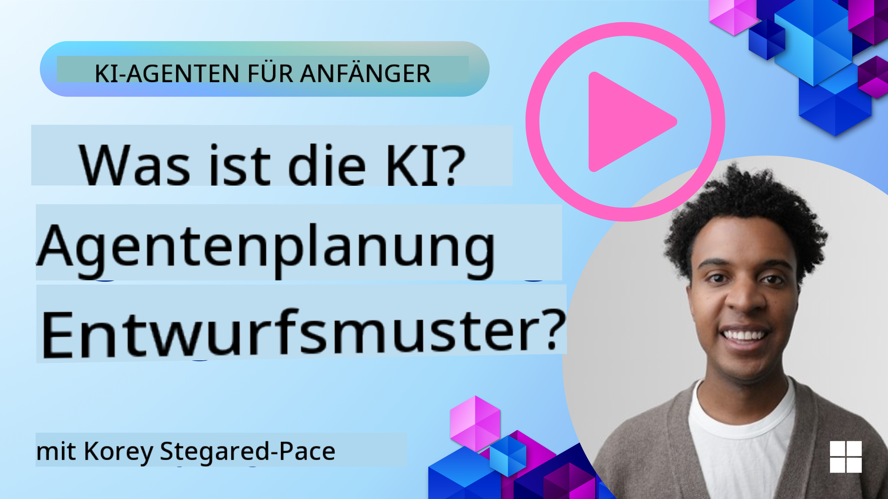
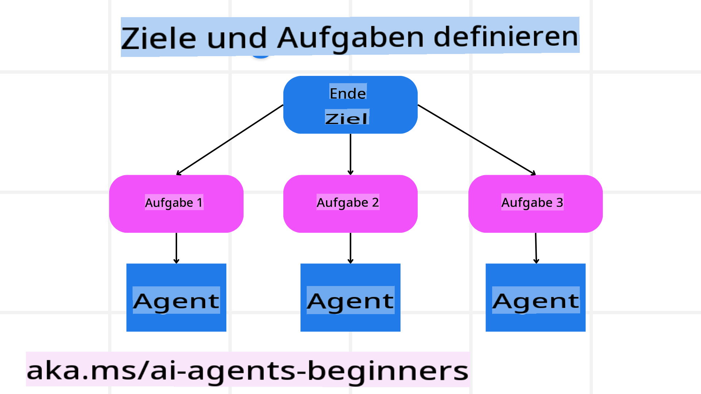

<!--
CO_OP_TRANSLATOR_METADATA:
{
  "original_hash": "8dd9a05d4dc18d3ff510e68e3798a080",
  "translation_date": "2025-03-28T10:31:24+00:00",
  "source_file": "07-planning-design\\README.md",
  "language_code": "de"
}
-->
[](https://youtu.be/kPfJ2BrBCMY?si=9pYpPXp0sSbK91Dr)

> _(Klicken Sie auf das Bild oben, um das Video zu dieser Lektion anzusehen)_

# Planungsdesign

## Einführung

Diese Lektion behandelt:

* Das Definieren eines klaren Gesamtziels und das Zerlegen einer komplexen Aufgabe in handhabbare Teilaufgaben.
* Die Nutzung von strukturiertem Output für zuverlässigere und maschinenlesbare Antworten.
* Die Anwendung eines ereignisgesteuerten Ansatzes zur Bearbeitung dynamischer Aufgaben und unerwarteter Eingaben.

## Lernziele

Nach Abschluss dieser Lektion verstehen Sie:

* Wie man ein Gesamtziel für einen KI-Agenten identifiziert und festlegt, damit dieser klar weiß, was erreicht werden soll.
* Wie man eine komplexe Aufgabe in handhabbare Teilaufgaben zerlegt und sie in eine logische Abfolge organisiert.
* Wie man Agenten mit den richtigen Werkzeugen ausstattet (z. B. Such- oder Datenanalysetools), entscheidet, wann und wie sie verwendet werden, und unerwartete Situationen bewältigt.
* Wie man Ergebnisse von Teilaufgaben bewertet, die Leistung misst und Maßnahmen ergreift, um den Endoutput zu verbessern.

## Das Gesamtziel definieren und eine Aufgabe zerlegen



Die meisten Aufgaben in der realen Welt sind zu komplex, um sie in einem einzigen Schritt zu bewältigen. Ein KI-Agent benötigt ein präzises Ziel, das seine Planung und Handlungen leitet. Betrachten wir zum Beispiel das Ziel:

    "Erstelle eine 3-tägige Reiseplanung."

Obwohl es einfach ausgedrückt ist, bedarf es dennoch einer Verfeinerung. Je klarer das Ziel ist, desto besser können der Agent (und mögliche menschliche Mitwirkende) sich darauf konzentrieren, das richtige Ergebnis zu erzielen, z. B. eine umfassende Reiseplanung mit Flugoptionen, Hotelvorschlägen und Aktivitätsempfehlungen.

### Aufgabenzerlegung

Große oder komplexe Aufgaben werden leichter handhabbar, wenn sie in kleinere, zielorientierte Teilaufgaben zerlegt werden.
Für das Beispiel der Reiseplanung könnte man das Ziel in folgende Unteraufgaben zerlegen:

* Flugbuchung
* Hotelbuchung
* Mietwagen
* Personalisierung

Jede Teilaufgabe kann dann von spezialisierten Agenten oder Prozessen bearbeitet werden. Ein Agent könnte sich auf die Suche nach den besten Flugangeboten konzentrieren, ein anderer auf Hotelbuchungen usw. Ein koordinierender oder „nachgeschalteter“ Agent kann diese Ergebnisse dann zu einer zusammenhängenden Reiseplanung für den Endnutzer zusammenführen.

Dieser modulare Ansatz ermöglicht auch schrittweise Verbesserungen. Beispielsweise könnten spezialisierte Agenten für Essensempfehlungen oder lokale Aktivitätsvorschläge hinzugefügt werden, um die Reiseplanung im Laufe der Zeit zu verfeinern.

### Strukturierter Output

Große Sprachmodelle (LLMs) können strukturierten Output (z. B. JSON) generieren, der für nachgeschaltete Agenten oder Dienste leichter zu analysieren und zu verarbeiten ist. Dies ist besonders in einem Multi-Agenten-Kontext nützlich, in dem diese Aufgaben nach Erhalt des Planungsergebnisses umgesetzt werden können. Für eine schnelle Übersicht:

Das folgende Python-Snippet zeigt, wie ein einfacher Planungsagent ein Ziel in Teilaufgaben zerlegt und einen strukturierten Plan erstellt:

```python
from pydantic import BaseModel
from enum import Enum
from typing import List, Optional, Union
import json
import os
from typing import Optional
from pprint import pprint
from autogen_core.models import UserMessage, SystemMessage, AssistantMessage
from autogen_ext.models.azure import AzureAIChatCompletionClient
from azure.core.credentials import AzureKeyCredential

class AgentEnum(str, Enum):
    FlightBooking = "flight_booking"
    HotelBooking = "hotel_booking"
    CarRental = "car_rental"
    ActivitiesBooking = "activities_booking"
    DestinationInfo = "destination_info"
    DefaultAgent = "default_agent"
    GroupChatManager = "group_chat_manager"

# Travel SubTask Model
class TravelSubTask(BaseModel):
    task_details: str
    assigned_agent: AgentEnum  # we want to assign the task to the agent

class TravelPlan(BaseModel):
    main_task: str
    subtasks: List[TravelSubTask]
    is_greeting: bool

client = AzureAIChatCompletionClient(
    model="gpt-4o-mini",
    endpoint="https://models.inference.ai.azure.com",
    # To authenticate with the model you will need to generate a personal access token (PAT) in your GitHub settings.
    # Create your PAT token by following instructions here: https://docs.github.com/en/authentication/keeping-your-account-and-data-secure/managing-your-personal-access-tokens
    credential=AzureKeyCredential(os.environ["GITHUB_TOKEN"]),
    model_info={
        "json_output": False,
        "function_calling": True,
        "vision": True,
        "family": "unknown",
    },
)

# Define the user message
messages = [
    SystemMessage(content="""You are an planner agent.
    Your job is to decide which agents to run based on the user's request.
                      Provide your response in JSON format with the following structure:
{'main_task': 'Plan a family trip from Singapore to Melbourne.',
 'subtasks': [{'assigned_agent': 'flight_booking',
               'task_details': 'Book round-trip flights from Singapore to '
                               'Melbourne.'}
    Below are the available agents specialised in different tasks:
    - FlightBooking: For booking flights and providing flight information
    - HotelBooking: For booking hotels and providing hotel information
    - CarRental: For booking cars and providing car rental information
    - ActivitiesBooking: For booking activities and providing activity information
    - DestinationInfo: For providing information about destinations
    - DefaultAgent: For handling general requests""", source="system"),
    UserMessage(
        content="Create a travel plan for a family of 2 kids from Singapore to Melboune", source="user"),
]

response = await client.create(messages=messages, extra_create_args={"response_format": 'json_object'})

response_content: Optional[str] = response.content if isinstance(
    response.content, str) else None
if response_content is None:
    raise ValueError("Response content is not a valid JSON string" )

pprint(json.loads(response_content))

# # Ensure the response content is a valid JSON string before loading it
# response_content: Optional[str] = response.content if isinstance(
#     response.content, str) else None
# if response_content is None:
#     raise ValueError("Response content is not a valid JSON string")

# # Print the response content after loading it as JSON
# pprint(json.loads(response_content))

# Validate the response content with the MathReasoning model
# TravelPlan.model_validate(json.loads(response_content))
```

### Planungsagent mit Multi-Agenten-Orchestrierung

In diesem Beispiel erhält ein Semantic Router Agent eine Benutzeranfrage (z. B. „Ich brauche eine Hotelplanung für meine Reise.“).

Der Planer:

* Erhält den Hotelplan: Der Planer nimmt die Nachricht des Benutzers und erstellt basierend auf einem System-Prompt (einschließlich verfügbarer Agentendetails) eine strukturierte Reiseplanung.
* Listet Agenten und deren Tools: Das Agentenregister enthält eine Liste von Agenten (z. B. für Flug-, Hotel-, Mietwagen- und Aktivitätenbuchung) zusammen mit den Funktionen oder Tools, die sie anbieten.
* Leitet den Plan an die jeweiligen Agenten weiter: Je nach Anzahl der Teilaufgaben sendet der Planer die Nachricht entweder direkt an einen dedizierten Agenten (bei Einzelaufgaben) oder koordiniert über einen Gruppen-Chat-Manager für die Zusammenarbeit mehrerer Agenten.
* Fasst das Ergebnis zusammen: Schließlich fasst der Planer die generierte Planung zur besseren Übersicht zusammen.

Der folgende Python-Code zeigt diese Schritte:

```python

from pydantic import BaseModel

from enum import Enum
from typing import List, Optional, Union

class AgentEnum(str, Enum):
    FlightBooking = "flight_booking"
    HotelBooking = "hotel_booking"
    CarRental = "car_rental"
    ActivitiesBooking = "activities_booking"
    DestinationInfo = "destination_info"
    DefaultAgent = "default_agent"
    GroupChatManager = "group_chat_manager"

# Travel SubTask Model

class TravelSubTask(BaseModel):
    task_details: str
    assigned_agent: AgentEnum # we want to assign the task to the agent

class TravelPlan(BaseModel):
    main_task: str
    subtasks: List[TravelSubTask]
    is_greeting: bool
import json
import os
from typing import Optional

from autogen_core.models import UserMessage, SystemMessage, AssistantMessage
from autogen_ext.models.openai import AzureOpenAIChatCompletionClient

# Create the client with type-checked environment variables

client = AzureOpenAIChatCompletionClient(
    azure_deployment=os.getenv("AZURE_OPENAI_DEPLOYMENT_NAME"),
    model=os.getenv("AZURE_OPENAI_DEPLOYMENT_NAME"),
    api_version=os.getenv("AZURE_OPENAI_API_VERSION"),
    azure_endpoint=os.getenv("AZURE_OPENAI_ENDPOINT"),
    api_key=os.getenv("AZURE_OPENAI_API_KEY"),
)

from pprint import pprint

# Define the user message

messages = [
    SystemMessage(content="""You are an planner agent.
    Your job is to decide which agents to run based on the user's request.
    Below are the available agents specialized in different tasks:
    - FlightBooking: For booking flights and providing flight information
    - HotelBooking: For booking hotels and providing hotel information
    - CarRental: For booking cars and providing car rental information
    - ActivitiesBooking: For booking activities and providing activity information
    - DestinationInfo: For providing information about destinations
    - DefaultAgent: For handling general requests""", source="system"),
    UserMessage(content="Create a travel plan for a family of 2 kids from Singapore to Melbourne", source="user"),
]

response = await client.create(messages=messages, extra_create_args={"response_format": TravelPlan})

# Ensure the response content is a valid JSON string before loading it

response_content: Optional[str] = response.content if isinstance(response.content, str) else None
if response_content is None:
    raise ValueError("Response content is not a valid JSON string")

# Print the response content after loading it as JSON

pprint(json.loads(response_content))
```

Das Ergebnis des vorherigen Codes kann dann verwendet werden, um die Aufgaben an `assigned_agent` weiterzuleiten und die Reiseplanung für den Endnutzer zusammenzufassen.

```json
{
    "is_greeting": "False",
    "main_task": "Plan a family trip from Singapore to Melbourne.",
    "subtasks": [
        {
            "assigned_agent": "flight_booking",
            "task_details": "Book round-trip flights from Singapore to Melbourne."
        },
        {
            "assigned_agent": "hotel_booking",
            "task_details": "Find family-friendly hotels in Melbourne."
        },
        {
            "assigned_agent": "car_rental",
            "task_details": "Arrange a car rental suitable for a family of four in Melbourne."
        },
        {
            "assigned_agent": "activities_booking",
            "task_details": "List family-friendly activities in Melbourne."
        },
        {
            "assigned_agent": "destination_info",
            "task_details": "Provide information about Melbourne as a travel destination."
        }
    ]
}
```

Ein Beispiel-Notebook mit dem vorherigen Code-Snippet ist [hier](../../../07-planning-design/07-autogen.ipynb) verfügbar.

### Iterative Planung

Einige Aufgaben erfordern eine iterative Vorgehensweise oder erneute Planung, bei der das Ergebnis einer Teilaufgabe die nächste beeinflusst. Wenn der Agent beispielsweise ein unerwartetes Datenformat bei der Flugbuchung entdeckt, muss er möglicherweise seine Strategie anpassen, bevor er mit der Hotelbuchung fortfährt.

Auch Benutzerfeedback (z. B. wenn ein Mensch entscheidet, dass er einen früheren Flug bevorzugt) kann eine teilweise Neuplanung auslösen. Dieser dynamische, iterative Ansatz stellt sicher, dass die endgültige Lösung den realen Einschränkungen und sich entwickelnden Benutzerpräferenzen entspricht.

Beispielcode:

```python
from autogen_core.models import UserMessage, SystemMessage, AssistantMessage
#.. same as previous code and pass on the user history, current plan
messages = [
    SystemMessage(content="""You are a planner agent to optimize the
    Your job is to decide which agents to run based on the user's request.
    Below are the available agents specialized in different tasks:
    - FlightBooking: For booking flights and providing flight information
    - HotelBooking: For booking hotels and providing hotel information
    - CarRental: For booking cars and providing car rental information
    - ActivitiesBooking: For booking activities and providing activity information
    - DestinationInfo: For providing information about destinations
    - DefaultAgent: For handling general requests""", source="system"),
    UserMessage(content="Create a travel plan for a family of 2 kids from Singapore to Melbourne", source="user"),
    AssistantMessage(content=f"Previous travel plan - {TravelPlan}", source="assistant")
]
# .. re-plan and send the tasks to respective agents
```

Für eine umfassendere Planung sehen Sie sich Magnetic One an, um komplexe Aufgaben zu lösen.

## Zusammenfassung

In diesem Artikel haben wir ein Beispiel dafür betrachtet, wie ein Planer erstellt werden kann, der dynamisch die verfügbaren definierten Agenten auswählt. Der Output des Planers zerlegt die Aufgaben und weist die Agenten zu, sodass diese ausgeführt werden können. Es wird davon ausgegangen, dass die Agenten Zugriff auf die Funktionen/Tools haben, die für die Ausführung der Aufgabe erforderlich sind. Zusätzlich zu den Agenten können Sie andere Muster wie Reflexion, Zusammenfassung und Round-Robin-Chat einbeziehen, um weitere Anpassungen vorzunehmen.

## Zusätzliche Ressourcen

* AutoGen Magnetic One – Ein generalistisches Multi-Agenten-System zur Lösung komplexer Aufgaben, das beeindruckende Ergebnisse bei mehreren herausfordernden Benchmarks erzielt hat. Referenz:

In dieser Implementierung erstellt der Orchestrator einen aufgabenbezogenen Plan und delegiert diese Aufgaben an die verfügbaren Agenten. Neben der Planung setzt der Orchestrator auch einen Tracking-Mechanismus ein, um den Fortschritt der Aufgaben zu überwachen und bei Bedarf neu zu planen.

## Vorherige Lektion

[Vertrauenswürdige KI-Agenten erstellen](../06-building-trustworthy-agents/README.md)

## Nächste Lektion

[Multi-Agenten-Design-Muster](../08-multi-agent/README.md)

**Haftungsausschluss**:  
Dieses Dokument wurde mithilfe des KI-Übersetzungsdienstes [Co-op Translator](https://github.com/Azure/co-op-translator) übersetzt. Obwohl wir uns um Genauigkeit bemühen, beachten Sie bitte, dass automatisierte Übersetzungen Fehler oder Ungenauigkeiten enthalten können. Das Originaldokument in seiner ursprünglichen Sprache sollte als maßgebliche Quelle betrachtet werden. Für kritische Informationen wird eine professionelle menschliche Übersetzung empfohlen. Wir haften nicht für Missverständnisse oder Fehlinterpretationen, die sich aus der Nutzung dieser Übersetzung ergeben.