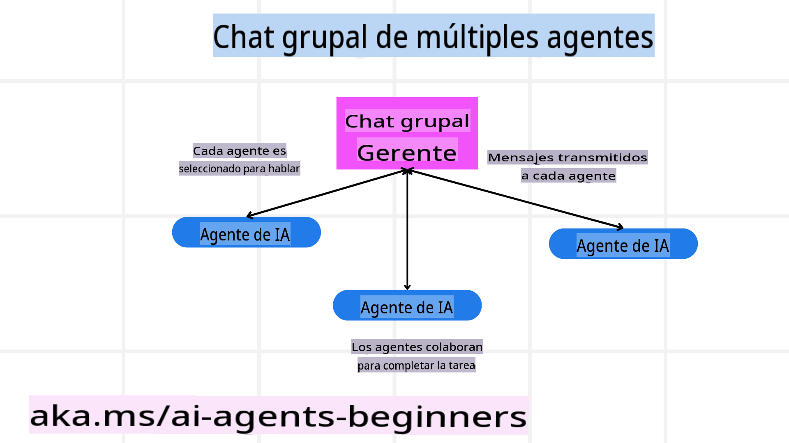
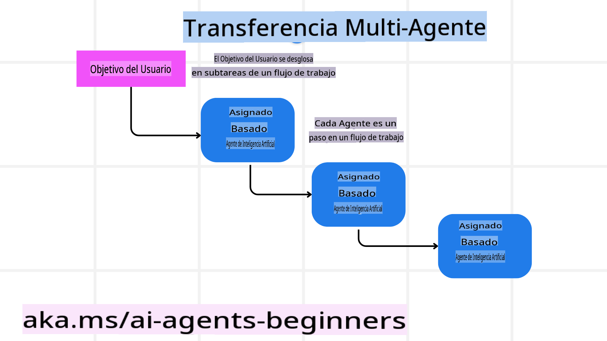
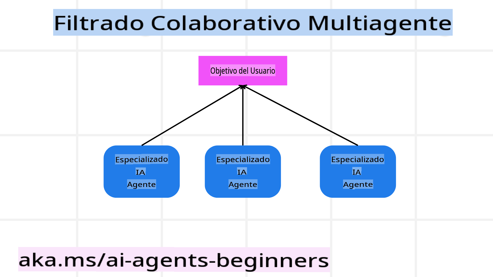

<!--
CO_OP_TRANSLATOR_METADATA:
{
  "original_hash": "bdb0a92e5a437d5fa985a6863f4a836c",
  "translation_date": "2025-03-28T10:32:27+00:00",
  "source_file": "08-multi-agent\\README.md",
  "language_code": "es"
}
-->

> _(Haz clic en la imagen de arriba para ver el video de esta lección)_

# Patrones de diseño multi-agente

Tan pronto como comiences a trabajar en un proyecto que involucre múltiples agentes, tendrás que considerar el patrón de diseño multi-agente. Sin embargo, puede que no sea inmediatamente evidente cuándo cambiar a múltiples agentes y cuáles son las ventajas.

## Introducción

En esta lección, buscamos responder las siguientes preguntas:

- ¿Cuáles son los escenarios donde los multi-agentes son aplicables?
- ¿Cuáles son las ventajas de usar multi-agentes en lugar de un único agente realizando múltiples tareas?
- ¿Cuáles son los componentes fundamentales para implementar el patrón de diseño multi-agente?
- ¿Cómo podemos tener visibilidad sobre cómo interactúan los múltiples agentes entre sí?

## Objetivos de aprendizaje

Después de esta lección, deberías ser capaz de:

- Identificar escenarios donde los multi-agentes son aplicables.
- Reconocer las ventajas de usar multi-agentes frente a un agente singular.
- Comprender los componentes fundamentales para implementar el patrón de diseño multi-agente.

¿Cuál es el panorama general?

*Los multi-agentes son un patrón de diseño que permite que múltiples agentes trabajen juntos para alcanzar un objetivo común*.

Este patrón se utiliza ampliamente en diversos campos, incluidos la robótica, los sistemas autónomos y la computación distribuida.

## Escenarios donde los multi-agentes son aplicables

Entonces, ¿qué escenarios son un buen caso de uso para emplear multi-agentes? La respuesta es que hay muchos escenarios donde el uso de múltiples agentes es beneficioso, especialmente en los siguientes casos:

- **Cargas de trabajo grandes**: Las cargas de trabajo grandes pueden dividirse en tareas más pequeñas y asignarse a diferentes agentes, permitiendo el procesamiento en paralelo y una finalización más rápida. Un ejemplo de esto es el caso de una tarea de procesamiento de datos a gran escala.
- **Tareas complejas**: Las tareas complejas, como las cargas de trabajo grandes, pueden dividirse en subtareas más pequeñas y asignarse a diferentes agentes, cada uno especializado en un aspecto específico de la tarea. Un buen ejemplo de esto es el caso de los vehículos autónomos donde diferentes agentes gestionan la navegación, la detección de obstáculos y la comunicación con otros vehículos.
- **Diversidad de experiencia**: Los diferentes agentes pueden tener diversas especialidades, permitiéndoles manejar distintos aspectos de una tarea de manera más efectiva que un único agente. En este caso, un buen ejemplo es el ámbito de la salud, donde los agentes pueden gestionar diagnósticos, planes de tratamiento y monitoreo de pacientes.

## Ventajas de usar multi-agentes frente a un agente singular

Un sistema de agente único podría funcionar bien para tareas simples, pero para tareas más complejas, el uso de múltiples agentes puede proporcionar varias ventajas:

- **Especialización**: Cada agente puede estar especializado en una tarea específica. La falta de especialización en un agente único significa que tienes un agente que puede hacer todo, pero podría confundirse sobre qué hacer cuando se enfrenta a una tarea compleja. Por ejemplo, podría terminar realizando una tarea para la cual no está mejor preparado.
- **Escalabilidad**: Es más fácil escalar sistemas añadiendo más agentes en lugar de sobrecargar un único agente.
- **Tolerancia a fallos**: Si un agente falla, otros pueden continuar funcionando, asegurando la fiabilidad del sistema.

Tomemos un ejemplo: reservar un viaje para un usuario. Un sistema de agente único tendría que manejar todos los aspectos del proceso de reserva del viaje, desde encontrar vuelos hasta reservar hoteles y coches de alquiler. Para lograr esto con un único agente, este necesitaría herramientas para manejar todas estas tareas. Esto podría llevar a un sistema complejo y monolítico que sea difícil de mantener y escalar. Un sistema multi-agente, en cambio, podría tener diferentes agentes especializados en encontrar vuelos, reservar hoteles y coches de alquiler. Esto haría que el sistema fuera más modular, fácil de mantener y escalable.

Compáralo con una agencia de viajes operada como un negocio familiar frente a una agencia de viajes operada como una franquicia. La tienda familiar tendría un único agente manejando todos los aspectos del proceso de reserva de viajes, mientras que la franquicia tendría diferentes agentes manejando diferentes aspectos del proceso.

## Componentes fundamentales para implementar el patrón de diseño multi-agente

Antes de poder implementar el patrón de diseño multi-agente, necesitas entender los componentes fundamentales que conforman el patrón.

Hagamos esto más concreto observando nuevamente el ejemplo de reservar un viaje para un usuario. En este caso, los componentes fundamentales incluirían:

- **Comunicación entre agentes**: Los agentes para encontrar vuelos, reservar hoteles y coches de alquiler necesitan comunicarse y compartir información sobre las preferencias y restricciones del usuario. Necesitas decidir los protocolos y métodos para esta comunicación. Esto significa concretamente que el agente para encontrar vuelos necesita comunicarse con el agente para reservar hoteles para asegurarse de que el hotel se reserve para las mismas fechas que el vuelo. Esto implica que los agentes deben compartir información sobre las fechas de viaje del usuario, lo que significa que necesitas decidir *qué agentes comparten información y cómo la comparten*.
- **Mecanismos de coordinación**: Los agentes necesitan coordinar sus acciones para garantizar que se cumplan las preferencias y restricciones del usuario. Una preferencia del usuario podría ser que desea un hotel cerca del aeropuerto, mientras que una restricción podría ser que los coches de alquiler solo están disponibles en el aeropuerto. Esto significa que el agente para reservar hoteles necesita coordinarse con el agente para reservar coches de alquiler para garantizar que se cumplan las preferencias y restricciones del usuario. Esto implica que necesitas decidir *cómo los agentes coordinan sus acciones*.
- **Arquitectura de agentes**: Los agentes necesitan tener la estructura interna para tomar decisiones y aprender de sus interacciones con el usuario. Esto significa que el agente para encontrar vuelos necesita tener la estructura interna para tomar decisiones sobre qué vuelos recomendar al usuario. Esto implica que necesitas decidir *cómo los agentes toman decisiones y aprenden de sus interacciones con el usuario*. Ejemplos de cómo un agente aprende y mejora podrían ser que el agente para encontrar vuelos podría usar un modelo de aprendizaje automático para recomendar vuelos al usuario basado en sus preferencias pasadas.
- **Visibilidad en las interacciones multi-agente**: Necesitas tener visibilidad sobre cómo interactúan entre sí los múltiples agentes. Esto significa que necesitas herramientas y técnicas para rastrear las actividades e interacciones de los agentes. Esto podría ser en forma de herramientas de registro y monitoreo, herramientas de visualización y métricas de rendimiento.
- **Patrones multi-agente**: Existen diferentes patrones para implementar sistemas multi-agente, como arquitecturas centralizadas, descentralizadas e híbridas. Necesitas decidir el patrón que mejor se ajuste a tu caso de uso.
- **Humano en el circuito**: En la mayoría de los casos, tendrás un humano en el circuito y necesitas instruir a los agentes cuándo pedir intervención humana. Esto podría ser en forma de un usuario solicitando un hotel o vuelo específico que los agentes no hayan recomendado o pidiendo confirmación antes de reservar un vuelo o hotel.

## Visibilidad en las interacciones multi-agente

Es importante que tengas visibilidad sobre cómo interactúan entre sí los múltiples agentes. Esta visibilidad es esencial para depurar, optimizar y garantizar la efectividad general del sistema. Para lograr esto, necesitas herramientas y técnicas para rastrear las actividades e interacciones de los agentes. Esto podría ser en forma de herramientas de registro y monitoreo, herramientas de visualización y métricas de rendimiento.

Por ejemplo, en el caso de reservar un viaje para un usuario, podrías tener un panel que muestre el estado de cada agente, las preferencias y restricciones del usuario, y las interacciones entre agentes. Este panel podría mostrar las fechas de viaje del usuario, los vuelos recomendados por el agente de vuelos, los hoteles recomendados por el agente de hoteles y los coches de alquiler recomendados por el agente de coches de alquiler. Esto te daría una vista clara de cómo los agentes están interactuando entre sí y si se están cumpliendo las preferencias y restricciones del usuario.

Veamos cada uno de estos aspectos con más detalle.

- **Herramientas de registro y monitoreo**: Quieres tener un registro de cada acción tomada por un agente. Una entrada de registro podría almacenar información sobre el agente que tomó la acción, la acción realizada, el momento en que se tomó la acción y el resultado de la acción. Esta información puede usarse para depurar, optimizar y más.

- **Herramientas de visualización**: Las herramientas de visualización pueden ayudarte a ver las interacciones entre los agentes de manera más intuitiva. Por ejemplo, podrías tener un gráfico que muestre el flujo de información entre los agentes. Esto podría ayudarte a identificar cuellos de botella, ineficiencias y otros problemas en el sistema.

- **Métricas de rendimiento**: Las métricas de rendimiento pueden ayudarte a rastrear la efectividad del sistema multi-agente. Por ejemplo, podrías rastrear el tiempo tomado para completar una tarea, el número de tareas completadas por unidad de tiempo y la precisión de las recomendaciones hechas por los agentes. Esta información puede ayudarte a identificar áreas de mejora y optimizar el sistema.

## Patrones multi-agente

Vamos a profundizar en algunos patrones concretos que podemos usar para crear aplicaciones multi-agente. Aquí hay algunos patrones interesantes que vale la pena considerar:

### Chat grupal

Este patrón es útil cuando deseas crear una aplicación de chat grupal donde múltiples agentes puedan comunicarse entre sí. Los casos de uso típicos para este patrón incluyen colaboración en equipo, soporte al cliente y redes sociales.

En este patrón, cada agente representa a un usuario en el chat grupal, y los mensajes se intercambian entre agentes utilizando un protocolo de mensajería. Los agentes pueden enviar mensajes al chat grupal, recibir mensajes del chat grupal y responder a mensajes de otros agentes.

Este patrón puede implementarse utilizando una arquitectura centralizada donde todos los mensajes se enrutan a través de un servidor central, o una arquitectura descentralizada donde los mensajes se intercambian directamente.

### Transferencia

Este patrón es útil cuando deseas crear una aplicación donde múltiples agentes puedan transferir tareas entre sí.

Los casos de uso típicos para este patrón incluyen soporte al cliente, gestión de tareas y automatización de flujos de trabajo.

En este patrón, cada agente representa una tarea o un paso en un flujo de trabajo, y los agentes pueden transferir tareas a otros agentes según reglas predefinidas.

### Filtrado colaborativo

Este patrón es útil cuando deseas crear una aplicación donde múltiples agentes puedan colaborar para hacer recomendaciones a los usuarios.

La razón por la que querrías que múltiples agentes colaboren es porque cada agente puede tener diferentes especialidades y puede contribuir al proceso de recomendación de diferentes maneras.

Tomemos un ejemplo donde un usuario quiere una recomendación sobre la mejor acción para comprar en el mercado de valores.

- **Experto en la industria**: Un agente podría ser experto en una industria específica.
- **Análisis técnico**: Otro agente podría ser experto en análisis técnico.
- **Análisis fundamental**: Y otro agente podría ser experto en análisis fundamental. Al colaborar, estos agentes pueden proporcionar una recomendación más completa al usuario.

## Escenario: Proceso de reembolso

Consideremos un escenario donde un cliente está intentando obtener un reembolso por un producto. Puede haber bastantes agentes involucrados en este proceso, pero dividámoslo entre agentes específicos para este proceso y agentes generales que pueden usarse en otros procesos.

**Agentes específicos para el proceso de reembolso**:

A continuación, se muestran algunos agentes que podrían estar involucrados en el proceso de reembolso:

- **Agente del cliente**: Este agente representa al cliente y es responsable de iniciar el proceso de reembolso.
- **Agente del vendedor**: Este agente representa al vendedor y es responsable de procesar el reembolso.
- **Agente de pagos**: Este agente representa el proceso de pago y es responsable de reembolsar el pago del cliente.
- **Agente de resolución**: Este agente representa el proceso de resolución y es responsable de resolver cualquier problema que surja durante el proceso de reembolso.
- **Agente de cumplimiento**: Este agente representa el proceso de cumplimiento y es responsable de garantizar que el proceso de reembolso cumpla con las regulaciones y políticas.

**Agentes generales**:

Estos agentes pueden usarse en otras partes de tu negocio.

- **Agente de envío**: Este agente representa el proceso de envío y es responsable de enviar el producto de vuelta al vendedor. Este agente puede usarse tanto para el proceso de reembolso como para el envío general de un producto, por ejemplo, durante una compra.
- **Agente de retroalimentación**: Este agente representa el proceso de retroalimentación y es responsable de recopilar comentarios del cliente. Los comentarios podrían obtenerse en cualquier momento y no solo durante el proceso de reembolso.
- **Agente de escalamiento**: Este agente representa el proceso de escalamiento y es responsable de escalar problemas a un nivel superior de soporte. Puedes usar este tipo de agente para cualquier proceso donde necesites escalar un problema.
- **Agente de notificaciones**: Este agente representa el proceso de notificaciones y es responsable de enviar notificaciones al cliente en varias etapas del proceso de reembolso.
- **Agente de análisis**: Este agente representa el proceso de análisis y es responsable de analizar datos relacionados con el proceso de reembolso.
- **Agente de auditoría**: Este agente representa el proceso de auditoría y es responsable de auditar el proceso de reembolso para garantizar que se esté llevando a cabo correctamente.
- **Agente de informes**: Este agente representa el proceso de informes y es responsable de generar informes sobre el proceso de reembolso.
- **Agente de conocimiento**: Este agente representa el proceso de conocimiento y es responsable de mantener una base de conocimiento de información relacionada con el proceso de reembolso. Este agente podría ser experto tanto en reembolsos como en otras partes de tu negocio.
- **Agente de seguridad**: Este agente representa el proceso de seguridad y es responsable de garantizar la seguridad del proceso de reembolso.
- **Agente de calidad**: Este agente representa el proceso de calidad y es responsable de garantizar la calidad del proceso de reembolso.

Hay bastantes agentes mencionados anteriormente, tanto para el proceso específico de reembolso como para los agentes generales que pueden usarse en otras partes de tu negocio. Con suerte, esto te da una idea de cómo puedes decidir qué agentes usar en tu sistema multi-agente.

## Tarea

Diseña un sistema multi-agente para un proceso de soporte al cliente. Identifica los agentes involucrados en el proceso, sus roles y responsabilidades, y cómo interactúan entre sí. Considera tanto agentes específicos para el proceso de soporte al cliente como agentes generales que pueden usarse en otras partes de tu negocio.

> Reflexiona antes de leer la siguiente solución, puede que necesites más agentes de los que crees.

> TIP: Piensa en las diferentes etapas del proceso de soporte al cliente y también considera los agentes necesarios para cualquier sistema.

## Solución

[Solución](./solution/solution.md)

## Preguntas de conocimiento

Pregunta: ¿Cuándo deberías considerar usar multi-agentes?

- [ ] A1: Cuando tienes una carga de trabajo pequeña y una tarea sencilla.
- [ ] A2: Cuando tienes una carga de trabajo grande.
- [ ] A3: Cuando tienes una tarea sencilla.

[Solución cuestionario](./solution/solution-quiz.md)

## Resumen

En esta lección, hemos analizado el patrón de diseño multi-agente, incluidos los escenarios donde los multi-agentes son aplicables, las ventajas de usar multi-agentes frente a un agente singular, los componentes fundamentales para implementar el patrón de diseño multi-agente y cómo tener visibilidad sobre cómo interactúan entre sí los múltiples agentes.

## Recursos adicionales

## Lección anterior

[Diseño de planificación](../07-planning-design/README.md)

## Próxima lección

[Metacognición en agentes de IA](../09-metacognition/README.md)

**Descargo de responsabilidad**:  
Este documento ha sido traducido utilizando el servicio de traducción automática [Co-op Translator](https://github.com/Azure/co-op-translator). Aunque nos esforzamos por garantizar la precisión, tenga en cuenta que las traducciones automatizadas pueden contener errores o imprecisiones. El documento original en su idioma nativo debe considerarse la fuente autorizada. Para información crítica, se recomienda una traducción profesional realizada por humanos. No nos hacemos responsables de malentendidos o interpretaciones erróneas que puedan surgir del uso de esta traducción.