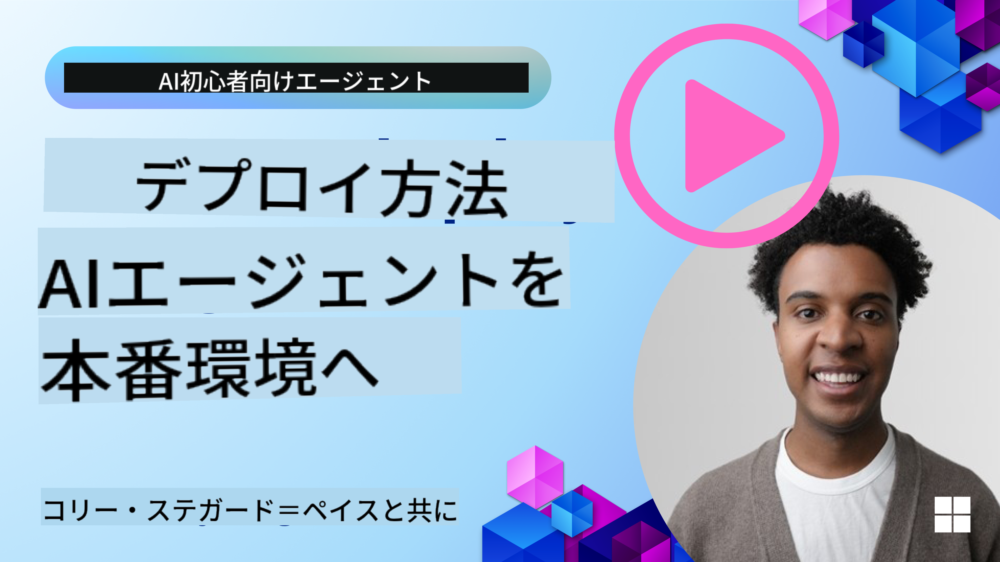

<!--
CO_OP_TRANSLATOR_METADATA:
{
  "original_hash": "44013a98d980c8b92d4b814dc49b545d",
  "translation_date": "2025-03-28T12:25:57+00:00",
  "source_file": "10-ai-agents-production\\README.md",
  "language_code": "ja"
}
-->

> _(上の画像をクリックすると、このレッスンの動画をご覧いただけます)_
# 本番環境でのAIエージェント

## はじめに

このレッスンでは以下について学びます：

- AIエージェントを本番環境に効果的に展開するための計画方法
- 本番環境にAIエージェントを展開する際に直面する可能性のある一般的なミスや問題
- コストを管理しながらAIエージェントのパフォーマンスを維持する方法

## 学習目標

このレッスンを完了すると、以下を理解し習得できます：

- 本番環境のAIエージェントシステムのパフォーマンス、コスト、効果を向上させるための技術
- AIエージェントの評価方法とその内容
- AIエージェントを本番環境に展開する際のコスト管理方法

信頼性の高いAIエージェントを展開することは重要です。「信頼できるAIエージェントの構築」レッスンもぜひチェックしてください。

## AIエージェントの評価

AIエージェントを展開する前、展開中、展開後に適切な評価システムを持つことが重要です。これにより、システムがあなたとユーザーの目標に合致していることを確認できます。

AIエージェントを評価する際には、エージェントの出力だけでなく、AIエージェントが動作しているシステム全体を評価できる能力が重要です。これには以下が含まれますが、これに限定されません：

- 初期モデルのリクエスト
- ユーザーの意図を特定するエージェントの能力
- タスクを実行するための適切なツールを特定するエージェントの能力
- ツールがエージェントのリクエストに応答する能力
- ツールの応答を解釈するエージェントの能力
- エージェントの応答に対するユーザーのフィードバック

これにより、改善すべき領域をよりモジュール化された方法で特定できます。その後、モデル、プロンプト、ツール、その他のコンポーネントに対する変更の効果を効率よく監視できます。

## AIエージェントにおける一般的な問題と解決策

| **問題**                                      | **解決策**                                                                                                                                                                                                     |
| ---------------------------------------------- | -------------------------------------------------------------------------------------------------------------------------------------------------------------------------------------------------------------------------- |
| AIエージェントがタスクを一貫して実行できない     | - AIエージェントに与えるプロンプトを精査し、目的を明確にする。 - タスクをサブタスクに分割し、複数のエージェントで対応する方法を検討する。                                                      |
| AIエージェントが連続ループに陥る                | - プロセスを終了するタイミングを明確に定義し、エージェントが停止条件を認識できるようにする。 - 推論や計画が必要な複雑なタスクには、推論に特化した大規模モデルを使用する。 |
| AIエージェントのツール呼び出しがうまく機能しない | - エージェントシステム外でツールの出力をテストし、検証する。 - ツールの定義されたパラメータ、プロンプト、名前付けを精査する。                                                                                        |
| マルチエージェントシステムが一貫して機能しない   | - 各エージェントに与えるプロンプトを精査し、具体的かつ相互に区別されるようにする。 - どのエージェントが適切かを判断する「ルーティング」またはコントローラーエージェントを使用して階層型システムを構築する。         |

## コスト管理

AIエージェントを本番環境に展開する際のコストを管理するための戦略を以下に示します：

- **応答のキャッシュ** - 共通のリクエストやタスクを特定し、エージェントシステムを通過する前に応答を提供することで、類似のリクエストの量を減らすことができます。基本的なAIモデルを使用してリクエストがキャッシュされたものとどれだけ似ているかを識別するフローを実装することも可能です。

- **小型モデルの使用** - 小型言語モデル（SLM）は、特定のエージェント使用ケースで良好なパフォーマンスを発揮し、コストを大幅に削減します。前述の通り、評価システムを構築して大規模モデルとの性能を比較し、SLMが使用ケースでどれほど効果的かを理解することが最善です。

- **ルーターモデルの使用** - 同様の戦略として、モデルやサイズの多様性を活用することが挙げられます。LLM/SLMやサーバーレス関数を使用して、リクエストの複雑さに応じて最適なモデルに振り分けることで、コストを削減しながら適切なタスクのパフォーマンスを確保できます。

## おめでとうございます

これで「初心者向けAIエージェント」の最後のレッスンが終了です。

この急成長する業界の変化やフィードバックに基づいて、今後もレッスンを追加していく予定ですので、ぜひまたお越しください。

AIエージェントについてさらに学び、構築を続けたい場合は、<a href="https://discord.gg/kzRShWzttr" target="_blank">Azure AI Community Discord</a>に参加してください。

ワークショップ、コミュニティラウンドテーブル、そして「何でも聞いてください」セッションを開催しています。

また、本番環境でAIエージェントを構築するための追加資料を集めたLearnコレクションもご用意しています。

## 前回のレッスン

[メタ認知デザインパターン](../09-metacognition/README.md)

**免責事項**:  
この文書はAI翻訳サービス[Co-op Translator](https://github.com/Azure/co-op-translator)を使用して翻訳されています。正確性を追求しておりますが、自動翻訳には誤りや不正確な部分が含まれる可能性があることをご承知おきください。元の文書（原言語）は権威ある情報源とみなされるべきです。重要な情報については、専門の人間による翻訳を推奨します。本翻訳の利用により生じた誤解や誤解釈について、当方は責任を負いません。