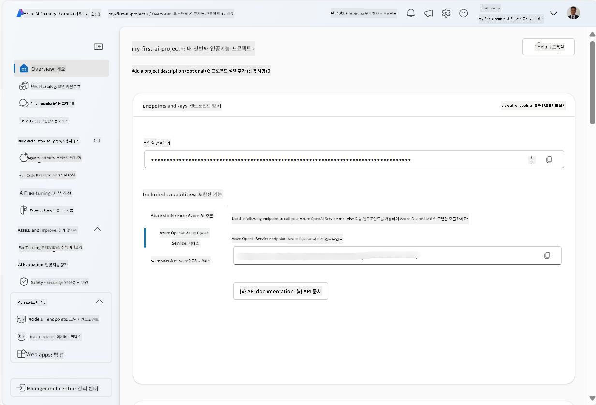
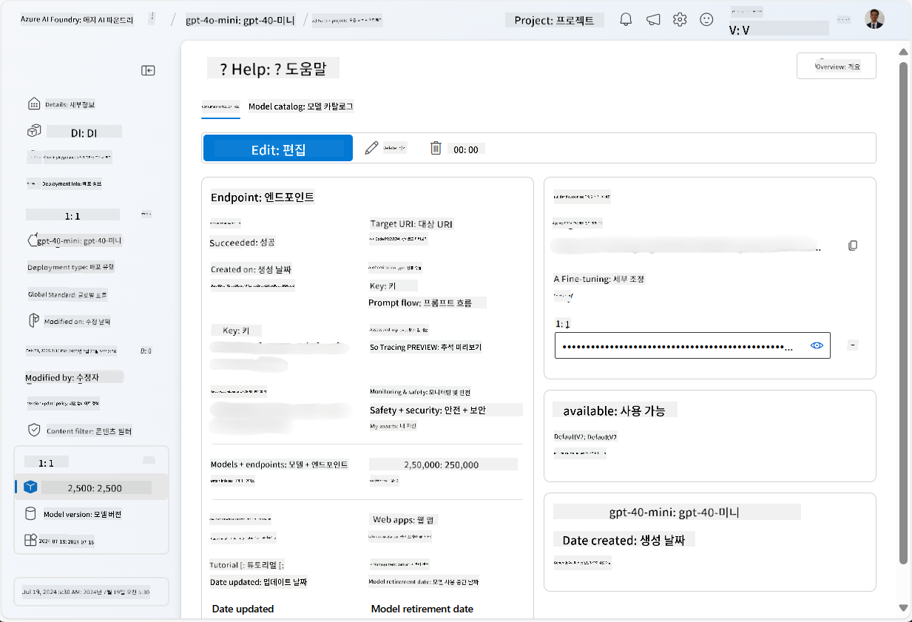
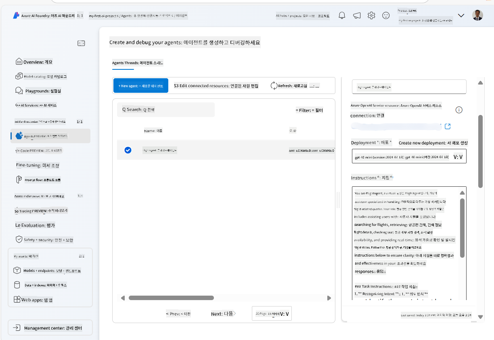
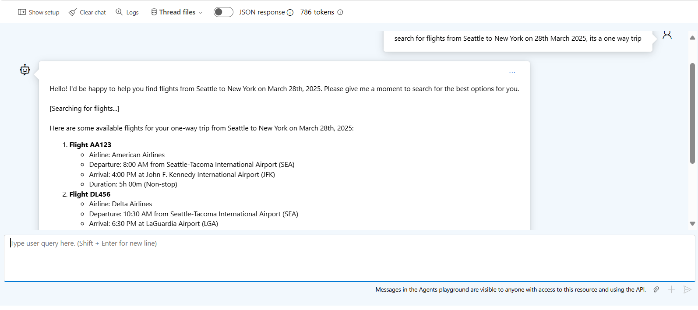

<!--
CO_OP_TRANSLATOR_METADATA:
{
  "original_hash": "664afc6dd1bf275b0eafd126b71da420",
  "translation_date": "2025-03-28T13:41:59+00:00",
  "source_file": "02-explore-agentic-frameworks\\azure-ai-foundry-agent-creation.md",
  "language_code": "ko"
}
-->
# Azure AI Agent 서비스 개발

이 실습에서는 [Azure AI Foundry 포털](https://ai.azure.com/?WT.mc_id=academic-105485-koreyst)의 Azure AI Agent 서비스 도구를 사용하여 항공편 예약 에이전트를 생성합니다. 이 에이전트는 사용자와 상호작용하며 항공편에 대한 정보를 제공할 수 있습니다.

## 사전 요구 사항

이 실습을 완료하려면 다음이 필요합니다:
1. 활성 구독이 있는 Azure 계정. [무료로 계정 생성하기](https://azure.microsoft.com/free/?WT.mc_id=academic-105485-koreyst).
2. Azure AI Foundry 허브를 생성할 수 있는 권한 또는 이미 생성된 허브가 필요합니다.
    - 역할이 Contributor 또는 Owner인 경우 이 튜토리얼의 단계를 따를 수 있습니다.

## Azure AI Foundry 허브 생성하기

> **Note:** Azure AI Foundry는 이전에 Azure AI Studio로 알려져 있었습니다.

1. [Azure AI Foundry](https://learn.microsoft.com/en-us/azure/ai-studio/?WT.mc_id=academic-105485-koreyst) 블로그 게시물의 지침을 따라 Azure AI Foundry 허브를 생성합니다.
2. 프로젝트가 생성되면 표시되는 팁을 닫고 Azure AI Foundry 포털에서 프로젝트 페이지를 검토합니다. 페이지는 다음 이미지와 유사해야 합니다:

    

## 모델 배포하기

1. 프로젝트의 왼쪽 창에서 **My assets** 섹션의 **Models + endpoints** 페이지를 선택합니다.
2. **Models + endpoints** 페이지의 **Model deployments** 탭에서 **+ Deploy model** 메뉴를 선택한 후 **Deploy base model**을 클릭합니다.
3. 목록에서 `gpt-4o-mini` 모델을 검색한 후 선택하고 확인합니다.

    > **Note**: TPM을 줄이면 사용 중인 구독의 할당량 초과를 방지할 수 있습니다.

    

## 에이전트 생성하기

모델을 배포한 후에는 에이전트를 생성할 수 있습니다. 에이전트는 사용자와 상호작용할 수 있는 대화형 AI 모델입니다.

1. 프로젝트의 왼쪽 창에서 **Build & Customize** 섹션의 **Agents** 페이지를 선택합니다.
2. **+ Create agent**를 클릭하여 새 에이전트를 생성합니다. **Agent Setup** 대화 상자에서:
    - 에이전트 이름을 입력합니다. 예: `FlightAgent`.
    - 이전에 생성한 `gpt-4o-mini` 모델 배포가 선택되어 있는지 확인합니다.
    - 에이전트가 따를 프롬프트에 따라 **Instructions**를 설정합니다. 예시는 다음과 같습니다:
    ```
    You are FlightAgent, a virtual assistant specialized in handling flight-related queries. Your role includes assisting users with searching for flights, retrieving flight details, checking seat availability, and providing real-time flight status. Follow the instructions below to ensure clarity and effectiveness in your responses:

    ### Task Instructions:
    1. **Recognizing Intent**:
       - Identify the user's intent based on their request, focusing on one of the following categories:
         - Searching for flights
         - Retrieving flight details using a flight ID
         - Checking seat availability for a specified flight
         - Providing real-time flight status using a flight number
       - If the intent is unclear, politely ask users to clarify or provide more details.
        
    2. **Processing Requests**:
        - Depending on the identified intent, perform the required task:
        - For flight searches: Request details such as origin, destination, departure date, and optionally return date.
        - For flight details: Request a valid flight ID.
        - For seat availability: Request the flight ID and date and validate inputs.
        - For flight status: Request a valid flight number.
        - Perform validations on provided data (e.g., formats of dates, flight numbers, or IDs). If the information is incomplete or invalid, return a friendly request for clarification.

    3. **Generating Responses**:
    - Use a tone that is friendly, concise, and supportive.
    - Provide clear and actionable suggestions based on the output of each task.
    - If no data is found or an error occurs, explain it to the user gently and offer alternative actions (e.g., refine search, try another query).
    
    ```
> [!NOTE]
> 자세한 프롬프트는 [이 저장소](https://github.com/ShivamGoyal03/RoamMind)를 참고하여 더 많은 정보를 얻을 수 있습니다.

> 또한, 에이전트의 기능을 향상시키기 위해 **Knowledge Base** 및 **Actions**를 추가하여 사용자 요청에 따라 더 많은 정보를 제공하거나 자동화된 작업을 수행할 수 있습니다. 이 실습에서는 이러한 단계는 생략할 수 있습니다.



3. 새 Multi-AI 에이전트를 생성하려면 **New Agent**를 클릭하기만 하면 됩니다. 새로 생성된 에이전트는 Agents 페이지에 표시됩니다.

## 에이전트 테스트하기

에이전트를 생성한 후에는 Azure AI Foundry 포털의 Playground에서 사용자 쿼리에 어떻게 응답하는지 테스트할 수 있습니다.

1. 에이전트의 **Setup** 창 상단에서 **Try in playground**를 선택합니다.
2. **Playground** 창에서 채팅 창에 쿼리를 입력하여 에이전트와 상호작용할 수 있습니다. 예를 들어, "28일에 시애틀에서 뉴욕으로 가는 항공편을 검색해줘"라고 요청할 수 있습니다.

    > **Note**: 이 실습에서는 실시간 데이터를 사용하지 않으므로 에이전트가 정확한 응답을 제공하지 않을 수 있습니다. 이 과정의 목적은 제공된 지침에 따라 사용자 쿼리를 이해하고 응답하는 에이전트의 능력을 테스트하는 것입니다.

    

3. 에이전트를 테스트한 후 더 많은 의도, 학습 데이터 및 액션을 추가하여 기능을 향상시킬 수 있습니다.

## 리소스 정리

에이전트를 테스트한 후 추가 비용을 방지하기 위해 삭제할 수 있습니다.
1. [Azure 포털](https://portal.azure.com)을 열고 이 실습에서 허브 리소스를 배포한 리소스 그룹의 내용을 확인합니다.
2. 도구 모음에서 **Delete resource group**을 선택합니다.
3. 리소스 그룹 이름을 입력하고 삭제를 확인합니다.

## 리소스

- [Azure AI Foundry 문서](https://learn.microsoft.com/en-us/azure/ai-studio/?WT.mc_id=academic-105485-koreyst)
- [Azure AI Foundry 포털](https://ai.azure.com/?WT.mc_id=academic-105485-koreyst)
- [Azure AI Studio 시작하기](https://techcommunity.microsoft.com/blog/educatordeveloperblog/getting-started-with-azure-ai-studio/4095602?WT.mc_id=academic-105485-koreyst)
- [Azure의 AI 에이전트 기본 사항](https://learn.microsoft.com/en-us/training/modules/ai-agent-fundamentals/?WT.mc_id=academic-105485-koreyst)
- [Azure AI Discord](https://aka.ms/AzureAI/Discord)

**면책 조항**:  
이 문서는 AI 번역 서비스 [Co-op Translator](https://github.com/Azure/co-op-translator)를 사용하여 번역되었습니다. 정확성을 위해 최선을 다하고 있지만, 자동 번역에는 오류나 부정확성이 포함될 수 있습니다. 원문이 작성된 언어의 문서를 권위 있는 자료로 간주해야 합니다. 중요한 정보의 경우, 전문적인 인간 번역을 권장합니다. 이 번역을 사용함으로써 발생하는 오해나 잘못된 해석에 대해 책임을 지지 않습니다.