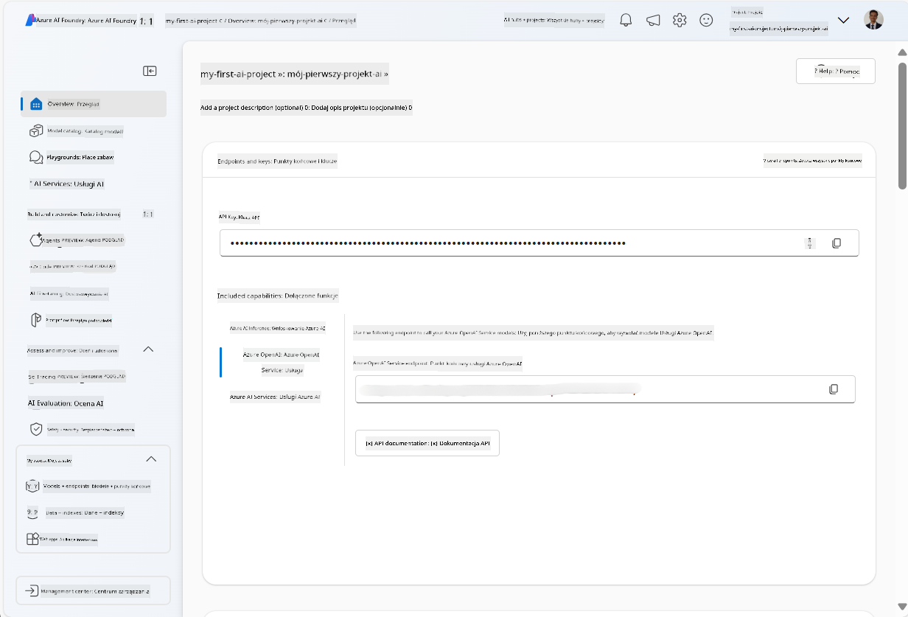
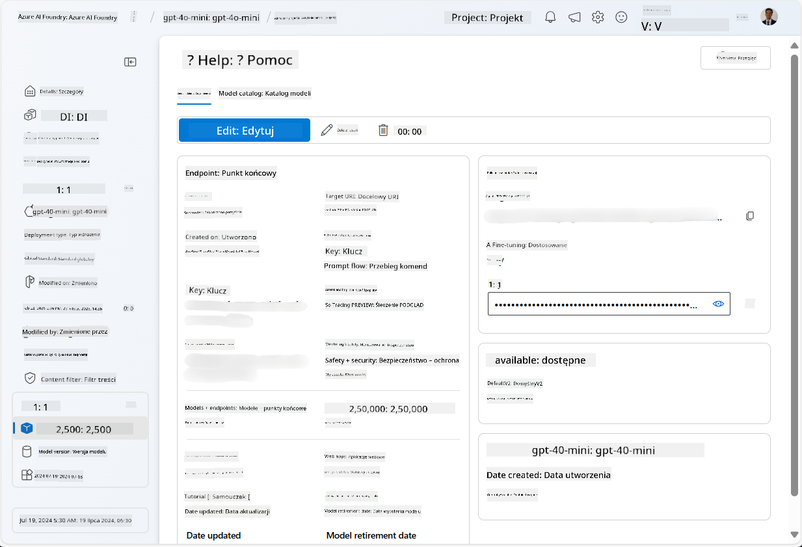
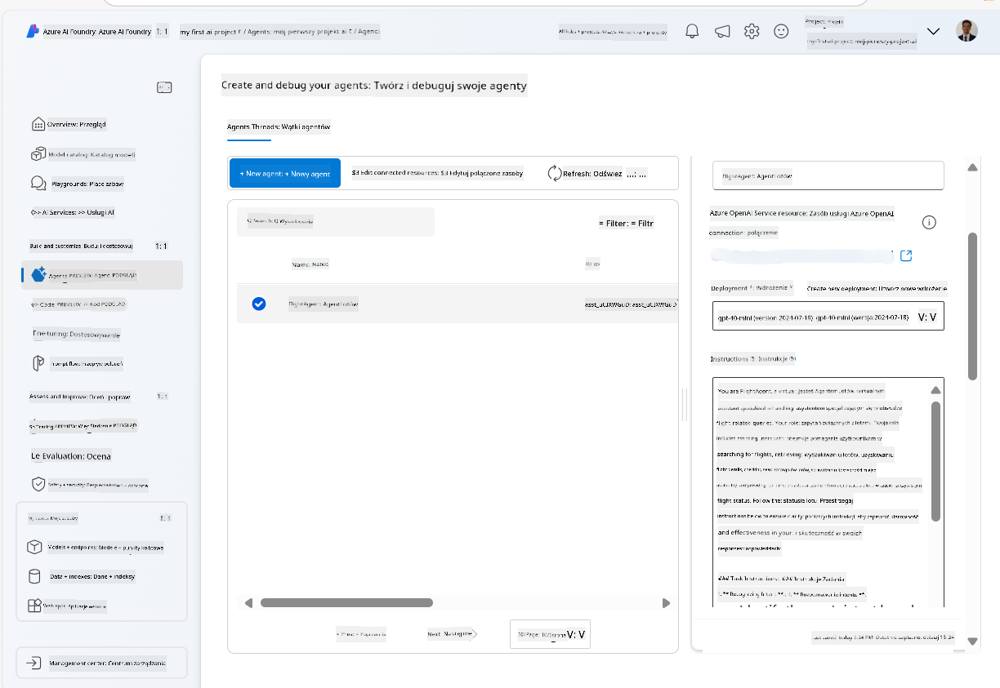
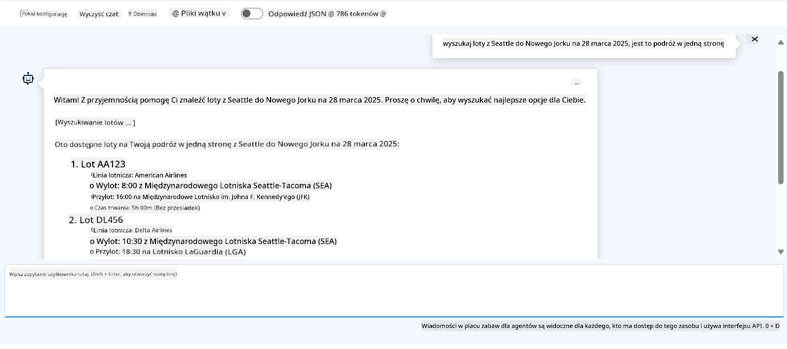

<!--
CO_OP_TRANSLATOR_METADATA:
{
  "original_hash": "664afc6dd1bf275b0eafd126b71da420",
  "translation_date": "2025-03-28T09:15:22+00:00",
  "source_file": "02-explore-agentic-frameworks\\azure-ai-foundry-agent-creation.md",
  "language_code": "pl"
}
-->
# Tworzenie usługi Azure AI Agent

W tym ćwiczeniu użyjesz narzędzi usługi Azure AI Agent dostępnych w [portalu Azure AI Foundry](https://ai.azure.com/?WT.mc_id=academic-105485-koreyst), aby stworzyć agenta do rezerwacji lotów. Agent będzie mógł wchodzić w interakcje z użytkownikami i udzielać informacji o lotach.

## Wymagania wstępne

Aby ukończyć to ćwiczenie, potrzebujesz:
1. Konta Azure z aktywną subskrypcją. [Utwórz konto za darmo](https://azure.microsoft.com/free/?WT.mc_id=academic-105485-koreyst).
2. Uprawnień do tworzenia huba Azure AI Foundry lub dostępu do już utworzonego.
    - Jeśli Twoja rola to Contributor lub Owner, możesz postępować zgodnie z krokami w tym tutorialu.

## Tworzenie huba Azure AI Foundry

> **Note:** Azure AI Foundry wcześniej znane było jako Azure AI Studio.

1. Postępuj zgodnie z wytycznymi z [blogu Azure AI Foundry](https://learn.microsoft.com/en-us/azure/ai-studio/?WT.mc_id=academic-105485-koreyst), aby utworzyć hub Azure AI Foundry.
2. Po utworzeniu projektu zamknij wszystkie wyświetlane wskazówki i przejrzyj stronę projektu w portalu Azure AI Foundry, która powinna wyglądać podobnie do poniższego obrazu:

    

## Wdrażanie modelu

1. W panelu po lewej stronie projektu, w sekcji **My assets**, wybierz stronę **Models + endpoints**.
2. Na stronie **Models + endpoints**, w zakładce **Model deployments**, w menu **+ Deploy model**, wybierz **Deploy base model**.
3. Wyszukaj model `gpt-4o-mini` na liście, a następnie wybierz go i potwierdź.

    > **Note**: Zmniejszenie TPM pomaga uniknąć nadmiernego wykorzystania dostępnego limitu w subskrypcji.

    

## Tworzenie agenta

Po wdrożeniu modelu możesz utworzyć agenta. Agent to model AI do rozmów, który można wykorzystać do interakcji z użytkownikami.

1. W panelu po lewej stronie projektu, w sekcji **Build & Customize**, wybierz stronę **Agents**.
2. Kliknij **+ Create agent**, aby utworzyć nowego agenta. W oknie dialogowym **Agent Setup**:
    - Wprowadź nazwę agenta, na przykład `FlightAgent`.
    - Upewnij się, że wybrano wdrożenie modelu `gpt-4o-mini`, które utworzyłeś wcześniej.
    - Ustaw **Instructions** zgodnie z poleceniem, które ma realizować agent. Oto przykład:
    ```
    You are FlightAgent, a virtual assistant specialized in handling flight-related queries. Your role includes assisting users with searching for flights, retrieving flight details, checking seat availability, and providing real-time flight status. Follow the instructions below to ensure clarity and effectiveness in your responses:

    ### Task Instructions:
    1. **Recognizing Intent**:
       - Identify the user's intent based on their request, focusing on one of the following categories:
         - Searching for flights
         - Retrieving flight details using a flight ID
         - Checking seat availability for a specified flight
         - Providing real-time flight status using a flight number
       - If the intent is unclear, politely ask users to clarify or provide more details.
        
    2. **Processing Requests**:
        - Depending on the identified intent, perform the required task:
        - For flight searches: Request details such as origin, destination, departure date, and optionally return date.
        - For flight details: Request a valid flight ID.
        - For seat availability: Request the flight ID and date and validate inputs.
        - For flight status: Request a valid flight number.
        - Perform validations on provided data (e.g., formats of dates, flight numbers, or IDs). If the information is incomplete or invalid, return a friendly request for clarification.

    3. **Generating Responses**:
    - Use a tone that is friendly, concise, and supportive.
    - Provide clear and actionable suggestions based on the output of each task.
    - If no data is found or an error occurs, explain it to the user gently and offer alternative actions (e.g., refine search, try another query).
    
    ```
> [!NOTE]
> Aby uzyskać szczegółowe polecenie, możesz sprawdzić [to repozytorium](https://github.com/ShivamGoyal03/RoamMind) dla dodatkowych informacji.
    
> Ponadto możesz dodać **Knowledge Base** i **Actions**, aby zwiększyć możliwości agenta w zakresie udzielania informacji i wykonywania zadań automatycznych na podstawie żądań użytkownika. W tym ćwiczeniu możesz pominąć te kroki.
    


3. Aby utworzyć nowego agenta multi-AI, po prostu kliknij **New Agent**. Nowo utworzony agent zostanie wyświetlony na stronie Agents.


## Testowanie agenta

Po utworzeniu agenta możesz go przetestować, aby sprawdzić, jak reaguje na zapytania użytkowników w portalu Azure AI Foundry.

1. Na górze panelu **Setup** dla Twojego agenta wybierz **Try in playground**.
2. W panelu **Playground** możesz wchodzić w interakcje z agentem, wpisując zapytania w oknie czatu. Na przykład możesz poprosić agenta o wyszukanie lotów z Seattle do Nowego Jorku na 28 dzień miesiąca.

    > **Note**: Agent może nie udzielać dokładnych odpowiedzi, ponieważ w tym ćwiczeniu nie są wykorzystywane dane w czasie rzeczywistym. Celem jest przetestowanie zdolności agenta do rozumienia i odpowiadania na zapytania użytkownika zgodnie z podanymi instrukcjami.

    

3. Po przetestowaniu agenta możesz dalej go dostosowywać, dodając więcej intencji, danych treningowych i akcji, aby zwiększyć jego możliwości.

## Czyszczenie zasobów

Po zakończeniu testowania agenta możesz go usunąć, aby uniknąć dodatkowych kosztów.
1. Otwórz [portal Azure](https://portal.azure.com) i wyświetl zawartość grupy zasobów, w której wdrożono zasoby hubu używane w tym ćwiczeniu.
2. Na pasku narzędzi wybierz **Delete resource group**.
3. Wprowadź nazwę grupy zasobów i potwierdź, że chcesz ją usunąć.

## Zasoby

- [Dokumentacja Azure AI Foundry](https://learn.microsoft.com/en-us/azure/ai-studio/?WT.mc_id=academic-105485-koreyst)
- [Portal Azure AI Foundry](https://ai.azure.com/?WT.mc_id=academic-105485-koreyst)
- [Pierwsze kroki z Azure AI Studio](https://techcommunity.microsoft.com/blog/educatordeveloperblog/getting-started-with-azure-ai-studio/4095602?WT.mc_id=academic-105485-koreyst)
- [Podstawy agentów AI na Azure](https://learn.microsoft.com/en-us/training/modules/ai-agent-fundamentals/?WT.mc_id=academic-105485-koreyst)
- [Azure AI Discord](https://aka.ms/AzureAI/Discord)

**Zastrzeżenie**:  
Ten dokument został przetłumaczony za pomocą usługi tłumaczeniowej AI [Co-op Translator](https://github.com/Azure/co-op-translator). Chociaż dokładamy wszelkich starań, aby tłumaczenie było precyzyjne, należy pamiętać, że automatyczne tłumaczenia mogą zawierać błędy lub nieścisłości. Oryginalny dokument w jego rodzimym języku powinien być uznawany za wiarygodne źródło. W przypadku informacji o kluczowym znaczeniu zaleca się skorzystanie z profesjonalnego tłumaczenia przez człowieka. Nie ponosimy odpowiedzialności za nieporozumienia lub błędne interpretacje wynikające z korzystania z tego tłumaczenia.