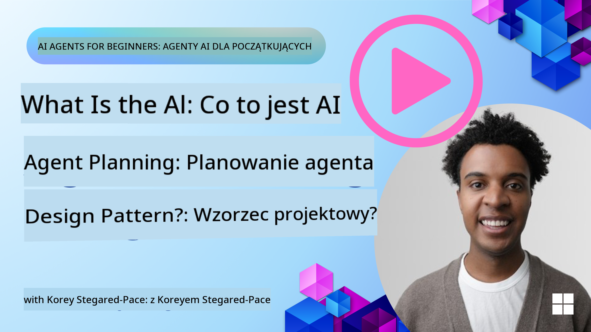
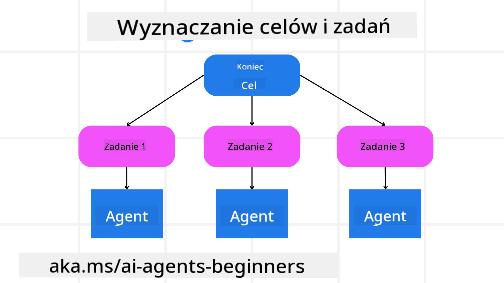

<!--
CO_OP_TRANSLATOR_METADATA:
{
  "original_hash": "8dd9a05d4dc18d3ff510e68e3798a080",
  "translation_date": "2025-03-28T09:29:06+00:00",
  "source_file": "07-planning-design\\README.md",
  "language_code": "pl"
}
-->
[](https://youtu.be/kPfJ2BrBCMY?si=9pYpPXp0sSbK91Dr)

> _(Kliknij obrazek powyżej, aby obejrzeć wideo z tej lekcji)_

# Planowanie Projektu

## Wprowadzenie

Ta lekcja obejmuje:

* Określenie jasnego celu ogólnego oraz rozbicie złożonego zadania na mniejsze, łatwiejsze do zarządzania części.
* Wykorzystanie ustrukturyzowanego wyjścia dla bardziej niezawodnych i czytelnych dla maszyn odpowiedzi.
* Zastosowanie podejścia opartego na zdarzeniach do obsługi dynamicznych zadań i nieoczekiwanych danych wejściowych.

## Cele Nauki

Po ukończeniu tej lekcji będziesz rozumieć, jak:

* Określić i ustalić cel ogólny dla agenta AI, zapewniając, że jasno wie, co należy osiągnąć.
* Rozłożyć złożone zadanie na mniejsze podzadania i zorganizować je w logicznej kolejności.
* Wyposażyć agentów w odpowiednie narzędzia (np. narzędzia wyszukiwania lub analizy danych), zdecydować, kiedy i jak ich używać, oraz radzić sobie z nieoczekiwanymi sytuacjami.
* Ocenić wyniki podzadań, mierzyć wydajność i iterować działania, aby poprawić ostateczny rezultat.

## Określenie Ogólnego Celu i Rozbicie Zadania



Większość zadań w rzeczywistości jest zbyt złożona, aby rozwiązać je w jednym kroku. Agent AI potrzebuje zwięzłego celu, który poprowadzi jego planowanie i działania. Na przykład rozważ cel:

    "Stwórz plan podróży na 3 dni."

Choć jest to prosty do wyrażenia cel, wymaga dalszego doprecyzowania. Im bardziej przejrzysty cel, tym lepiej agent (oraz wszyscy ludzie współpracujący) mogą skoncentrować się na osiągnięciu właściwego rezultatu, takiego jak stworzenie kompleksowego planu podróży z opcjami lotów, rekomendacjami hoteli i propozycjami atrakcji.

### Rozbicie Zadania na Podzadania

Duże lub skomplikowane zadania stają się bardziej przystępne, gdy zostaną podzielone na mniejsze, zorientowane na cel podzadania. 
W przypadku planu podróży możesz podzielić cel na:

* Rezerwacja lotów
* Rezerwacja hoteli
* Wynajem samochodu
* Personalizacja

Każde podzadanie może być realizowane przez dedykowanych agentów lub procesy. Jeden agent może specjalizować się w wyszukiwaniu najlepszych ofert lotów, inny w rezerwacji hoteli itd. Koordynujący lub „dowstreamowy” agent może następnie zintegrować te wyniki w jeden spójny plan dla użytkownika końcowego.

Takie modułowe podejście umożliwia również stopniowe ulepszenia. Na przykład można dodać wyspecjalizowanych agentów zajmujących się rekomendacjami kulinarnymi lub lokalnymi atrakcjami i z czasem udoskonalać plan podróży.

### Ustrukturyzowane Wyjście

Duże modele językowe (LLM) mogą generować ustrukturyzowane wyjście (np. JSON), które jest łatwiejsze do analizy i przetwarzania przez kolejne agentów lub usługi. Jest to szczególnie przydatne w kontekście wieloagentowym, gdzie można realizować zadania po otrzymaniu wyników planowania. Zobacz poniżej dla szybkiego przeglądu.

Poniższy fragment kodu w Pythonie pokazuje prostego agenta planującego, który rozbija cel na podzadania i generuje ustrukturyzowany plan:

```python
from pydantic import BaseModel
from enum import Enum
from typing import List, Optional, Union
import json
import os
from typing import Optional
from pprint import pprint
from autogen_core.models import UserMessage, SystemMessage, AssistantMessage
from autogen_ext.models.azure import AzureAIChatCompletionClient
from azure.core.credentials import AzureKeyCredential

class AgentEnum(str, Enum):
    FlightBooking = "flight_booking"
    HotelBooking = "hotel_booking"
    CarRental = "car_rental"
    ActivitiesBooking = "activities_booking"
    DestinationInfo = "destination_info"
    DefaultAgent = "default_agent"
    GroupChatManager = "group_chat_manager"

# Travel SubTask Model
class TravelSubTask(BaseModel):
    task_details: str
    assigned_agent: AgentEnum  # we want to assign the task to the agent

class TravelPlan(BaseModel):
    main_task: str
    subtasks: List[TravelSubTask]
    is_greeting: bool

client = AzureAIChatCompletionClient(
    model="gpt-4o-mini",
    endpoint="https://models.inference.ai.azure.com",
    # To authenticate with the model you will need to generate a personal access token (PAT) in your GitHub settings.
    # Create your PAT token by following instructions here: https://docs.github.com/en/authentication/keeping-your-account-and-data-secure/managing-your-personal-access-tokens
    credential=AzureKeyCredential(os.environ["GITHUB_TOKEN"]),
    model_info={
        "json_output": False,
        "function_calling": True,
        "vision": True,
        "family": "unknown",
    },
)

# Define the user message
messages = [
    SystemMessage(content="""You are an planner agent.
    Your job is to decide which agents to run based on the user's request.
                      Provide your response in JSON format with the following structure:
{'main_task': 'Plan a family trip from Singapore to Melbourne.',
 'subtasks': [{'assigned_agent': 'flight_booking',
               'task_details': 'Book round-trip flights from Singapore to '
                               'Melbourne.'}
    Below are the available agents specialised in different tasks:
    - FlightBooking: For booking flights and providing flight information
    - HotelBooking: For booking hotels and providing hotel information
    - CarRental: For booking cars and providing car rental information
    - ActivitiesBooking: For booking activities and providing activity information
    - DestinationInfo: For providing information about destinations
    - DefaultAgent: For handling general requests""", source="system"),
    UserMessage(
        content="Create a travel plan for a family of 2 kids from Singapore to Melboune", source="user"),
]

response = await client.create(messages=messages, extra_create_args={"response_format": 'json_object'})

response_content: Optional[str] = response.content if isinstance(
    response.content, str) else None
if response_content is None:
    raise ValueError("Response content is not a valid JSON string" )

pprint(json.loads(response_content))

# # Ensure the response content is a valid JSON string before loading it
# response_content: Optional[str] = response.content if isinstance(
#     response.content, str) else None
# if response_content is None:
#     raise ValueError("Response content is not a valid JSON string")

# # Print the response content after loading it as JSON
# pprint(json.loads(response_content))

# Validate the response content with the MathReasoning model
# TravelPlan.model_validate(json.loads(response_content))
```

### Agent Planowania z Orkiestracją Wieloagentową

W tym przykładzie agent Semantic Router odbiera zapytanie użytkownika (np. "Potrzebuję planu hotelowego na moją podróż.").

Planista następnie:

* Otrzymuje Plan Hotelowy: Planista przyjmuje wiadomość użytkownika i na podstawie systemowego promptu (zawierającego szczegóły dostępnych agentów) generuje ustrukturyzowany plan podróży.
* Wymienia Agentów i Ich Narzędzia: Rejestr agentów zawiera listę agentów (np. do lotów, hoteli, wynajmu samochodów i atrakcji) wraz z funkcjami lub narzędziami, które oferują.
* Przekazuje Plan do Odpowiednich Agentów: W zależności od liczby podzadań planista albo wysyła wiadomość bezpośrednio do dedykowanego agenta (w przypadku scenariuszy z jednym zadaniem), albo koordynuje za pomocą menedżera czatu grupowego w celu współpracy wieloagentowej.
* Podsumowuje Wynik: Na koniec planista podsumowuje wygenerowany plan dla przejrzystości.
Poniższy fragment kodu w Pythonie ilustruje te kroki:

```python

from pydantic import BaseModel

from enum import Enum
from typing import List, Optional, Union

class AgentEnum(str, Enum):
    FlightBooking = "flight_booking"
    HotelBooking = "hotel_booking"
    CarRental = "car_rental"
    ActivitiesBooking = "activities_booking"
    DestinationInfo = "destination_info"
    DefaultAgent = "default_agent"
    GroupChatManager = "group_chat_manager"

# Travel SubTask Model

class TravelSubTask(BaseModel):
    task_details: str
    assigned_agent: AgentEnum # we want to assign the task to the agent

class TravelPlan(BaseModel):
    main_task: str
    subtasks: List[TravelSubTask]
    is_greeting: bool
import json
import os
from typing import Optional

from autogen_core.models import UserMessage, SystemMessage, AssistantMessage
from autogen_ext.models.openai import AzureOpenAIChatCompletionClient

# Create the client with type-checked environment variables

client = AzureOpenAIChatCompletionClient(
    azure_deployment=os.getenv("AZURE_OPENAI_DEPLOYMENT_NAME"),
    model=os.getenv("AZURE_OPENAI_DEPLOYMENT_NAME"),
    api_version=os.getenv("AZURE_OPENAI_API_VERSION"),
    azure_endpoint=os.getenv("AZURE_OPENAI_ENDPOINT"),
    api_key=os.getenv("AZURE_OPENAI_API_KEY"),
)

from pprint import pprint

# Define the user message

messages = [
    SystemMessage(content="""You are an planner agent.
    Your job is to decide which agents to run based on the user's request.
    Below are the available agents specialized in different tasks:
    - FlightBooking: For booking flights and providing flight information
    - HotelBooking: For booking hotels and providing hotel information
    - CarRental: For booking cars and providing car rental information
    - ActivitiesBooking: For booking activities and providing activity information
    - DestinationInfo: For providing information about destinations
    - DefaultAgent: For handling general requests""", source="system"),
    UserMessage(content="Create a travel plan for a family of 2 kids from Singapore to Melbourne", source="user"),
]

response = await client.create(messages=messages, extra_create_args={"response_format": TravelPlan})

# Ensure the response content is a valid JSON string before loading it

response_content: Optional[str] = response.content if isinstance(response.content, str) else None
if response_content is None:
    raise ValueError("Response content is not a valid JSON string")

# Print the response content after loading it as JSON

pprint(json.loads(response_content))
```

Poniżej znajduje się wynik poprzedniego kodu, który można następnie wykorzystać do przekierowania do `assigned_agent` i podsumowania planu podróży dla użytkownika końcowego.

```json
{
    "is_greeting": "False",
    "main_task": "Plan a family trip from Singapore to Melbourne.",
    "subtasks": [
        {
            "assigned_agent": "flight_booking",
            "task_details": "Book round-trip flights from Singapore to Melbourne."
        },
        {
            "assigned_agent": "hotel_booking",
            "task_details": "Find family-friendly hotels in Melbourne."
        },
        {
            "assigned_agent": "car_rental",
            "task_details": "Arrange a car rental suitable for a family of four in Melbourne."
        },
        {
            "assigned_agent": "activities_booking",
            "task_details": "List family-friendly activities in Melbourne."
        },
        {
            "assigned_agent": "destination_info",
            "task_details": "Provide information about Melbourne as a travel destination."
        }
    ]
}
```

Przykładowy notebook z poprzednim fragmentem kodu jest dostępny [tutaj](../../../07-planning-design/07-autogen.ipynb).

### Iteracyjne Planowanie

Niektóre zadania wymagają podejścia iteracyjnego, w którym wynik jednego podzadania wpływa na kolejne. Na przykład, jeśli agent odkryje nieoczekiwany format danych podczas rezerwacji lotów, może być konieczne dostosowanie strategii przed przejściem do rezerwacji hoteli.

Dodatkowo, opinie użytkownika (np. decyzja, że preferuje wcześniejszy lot) mogą wywołać częściowe przeplanowanie. Takie dynamiczne, iteracyjne podejście zapewnia, że ostateczne rozwiązanie jest zgodne z rzeczywistymi ograniczeniami i zmieniającymi się preferencjami użytkownika.

np. przykład kodu

```python
from autogen_core.models import UserMessage, SystemMessage, AssistantMessage
#.. same as previous code and pass on the user history, current plan
messages = [
    SystemMessage(content="""You are a planner agent to optimize the
    Your job is to decide which agents to run based on the user's request.
    Below are the available agents specialized in different tasks:
    - FlightBooking: For booking flights and providing flight information
    - HotelBooking: For booking hotels and providing hotel information
    - CarRental: For booking cars and providing car rental information
    - ActivitiesBooking: For booking activities and providing activity information
    - DestinationInfo: For providing information about destinations
    - DefaultAgent: For handling general requests""", source="system"),
    UserMessage(content="Create a travel plan for a family of 2 kids from Singapore to Melbourne", source="user"),
    AssistantMessage(content=f"Previous travel plan - {TravelPlan}", source="assistant")
]
# .. re-plan and send the tasks to respective agents
```

Dla bardziej kompleksowego planowania zapoznaj się z Magnetic One do rozwiązywania złożonych zadań.

## Podsumowanie

W tym artykule omówiliśmy przykład, jak można stworzyć planistę, który dynamicznie wybiera dostępnych agentów. Wyjście z Planisty rozkłada zadania i przypisuje agentów, aby mogły zostać wykonane. Zakłada się, że agenci mają dostęp do funkcji/narzędzi wymaganych do wykonania zadania. Oprócz agentów można włączyć inne wzorce, takie jak refleksja, podsumowanie i rotacja czatu, aby jeszcze bardziej dostosować proces.

## Dodatkowe Materiały

* AutoGen Magnetic One - Uniwersalny system wieloagentowy do rozwiązywania złożonych zadań, który osiągnął imponujące wyniki w wielu wymagających benchmarkach agentowych. Referencja:

. W tej implementacji orkiestrator tworzy plan specyficzny dla zadania i deleguje te zadania dostępnym agentom. Oprócz planowania orkiestrator wykorzystuje również mechanizm śledzenia do monitorowania postępów zadania i przeplanowania w razie potrzeby.

## Poprzednia Lekcja

[Budowanie Godnych Zaufania Agentów AI](../06-building-trustworthy-agents/README.md)

## Następna Lekcja

[Wzorzec Projektowy Wieloagentowy](../08-multi-agent/README.md)

**Zastrzeżenie**:  
Ten dokument został przetłumaczony za pomocą usługi tłumaczenia AI [Co-op Translator](https://github.com/Azure/co-op-translator). Chociaż dokładamy wszelkich starań, aby zapewnić poprawność, prosimy pamiętać, że automatyczne tłumaczenia mogą zawierać błędy lub nieścisłości. Oryginalny dokument w jego języku źródłowym powinien być traktowany jako autorytatywne źródło. W przypadku informacji o kluczowym znaczeniu zaleca się skorzystanie z profesjonalnego tłumaczenia wykonanego przez człowieka. Nie ponosimy odpowiedzialności za wszelkie nieporozumienia lub błędne interpretacje wynikające z korzystania z tego tłumaczenia.