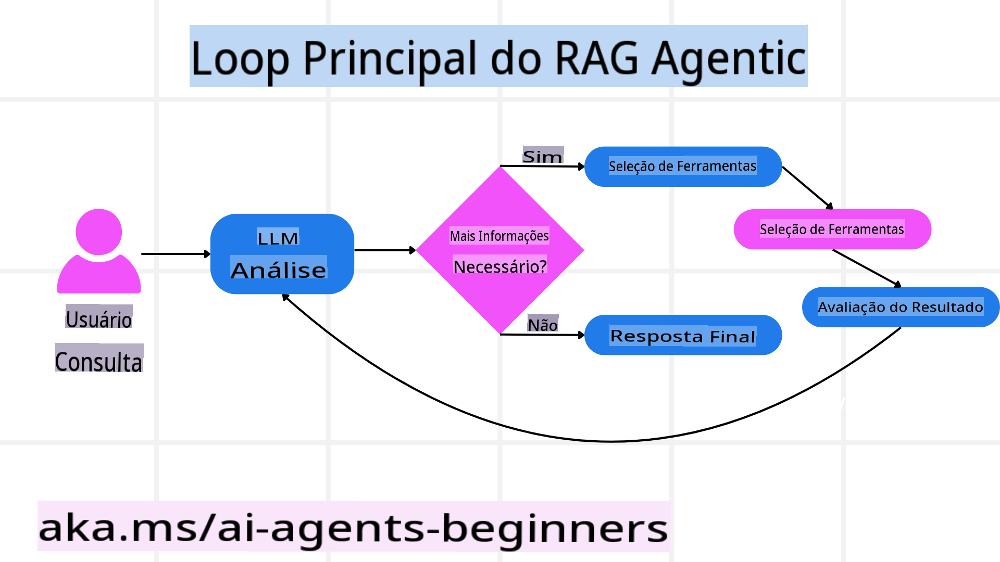
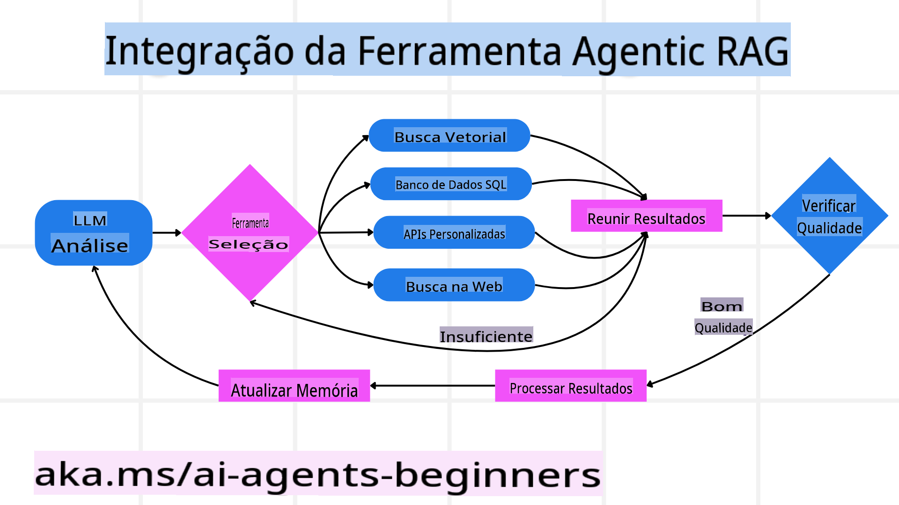
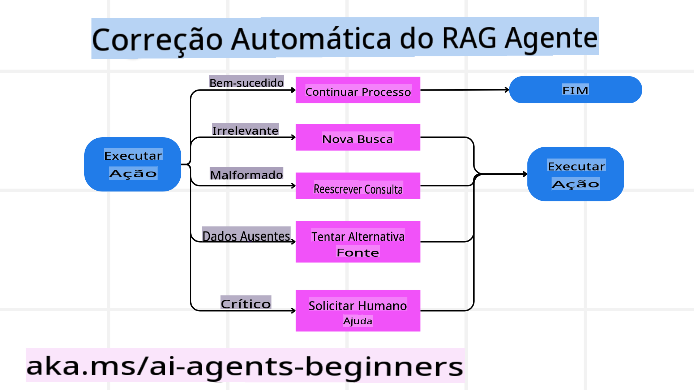
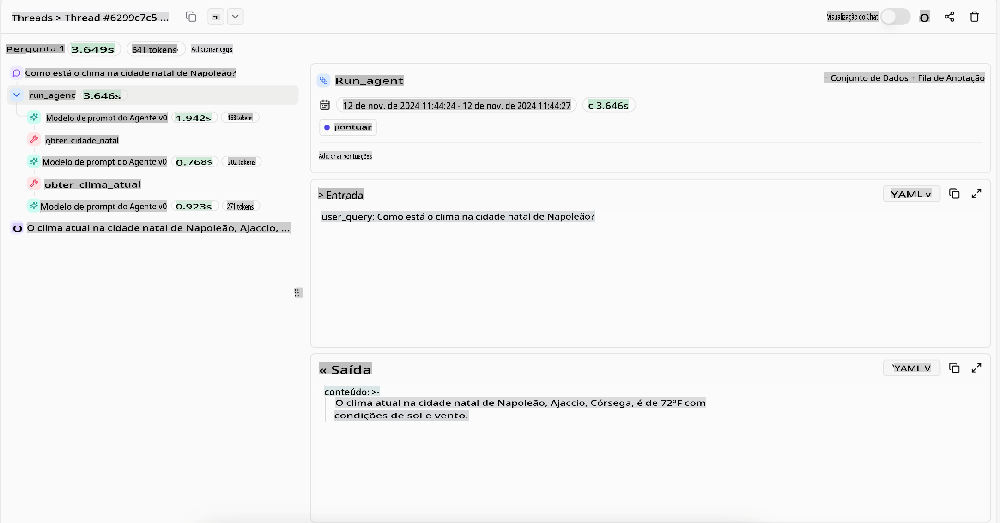
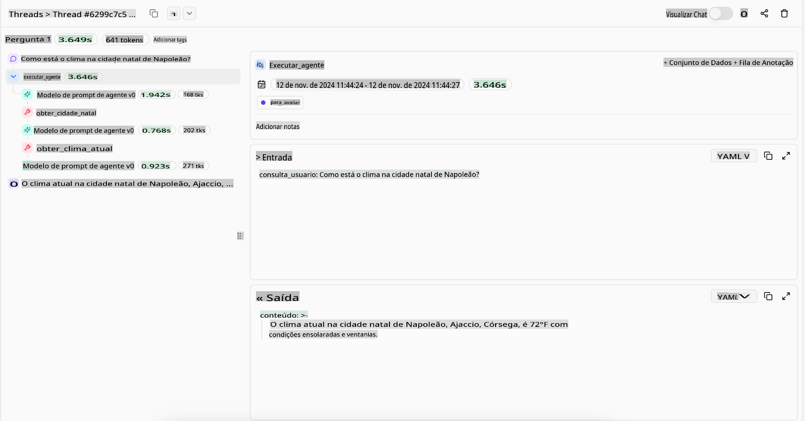

<!--
CO_OP_TRANSLATOR_METADATA:
{
  "original_hash": "4d215d159f2f3b96644fd62657988d23",
  "translation_date": "2025-03-28T11:54:32+00:00",
  "source_file": "05-agentic-rag\\README.md",
  "language_code": "pt"
}
-->

> _(Clique na imagem acima para assistir ao vídeo desta lição)_

# Agentic RAG

Esta lição oferece uma visão abrangente sobre o Agentic Retrieval-Augmented Generation (Agentic RAG), um paradigma emergente de IA onde modelos de linguagem de grande escala (LLMs) planejam autonomamente seus próximos passos enquanto acessam informações de fontes externas. Diferentemente dos padrões estáticos de recuperação e leitura, o Agentic RAG envolve chamadas iterativas ao LLM, intercaladas com chamadas de ferramentas ou funções e saídas estruturadas. O sistema avalia resultados, refina consultas, utiliza ferramentas adicionais quando necessário e continua esse ciclo até alcançar uma solução satisfatória.

## Introdução

Nesta lição, você aprenderá:

- **Entender o Agentic RAG:** Conheça o paradigma emergente de IA onde modelos de linguagem de grande escala (LLMs) planejam autonomamente seus próximos passos enquanto acessam informações de fontes externas.
- **Compreender o Estilo Iterativo Maker-Checker:** Entenda o ciclo de chamadas iterativas ao LLM, intercaladas com chamadas de ferramentas ou funções e saídas estruturadas, projetadas para melhorar a precisão e lidar com consultas malformadas.
- **Explorar Aplicações Práticas:** Identifique cenários onde o Agentic RAG se destaca, como ambientes com foco na precisão, interações complexas com bancos de dados e fluxos de trabalho estendidos.

## Objetivos de Aprendizagem

Após concluir esta lição, você saberá como/entenderá:

- **Entender o Agentic RAG:** Conheça o paradigma emergente de IA onde modelos de linguagem de grande escala (LLMs) planejam autonomamente seus próximos passos enquanto acessam informações de fontes externas.
- **Estilo Iterativo Maker-Checker:** Compreenda o conceito de um ciclo de chamadas iterativas ao LLM, intercaladas com chamadas de ferramentas ou funções e saídas estruturadas, projetadas para melhorar a precisão e lidar com consultas malformadas.
- **Controlar o Processo de Raciocínio:** Compreenda a capacidade do sistema de controlar seu próprio processo de raciocínio, tomando decisões sobre como abordar problemas sem depender de caminhos predefinidos.
- **Fluxo de Trabalho:** Entenda como um modelo agentic decide de forma independente acessar relatórios de tendências de mercado, identificar dados de concorrentes, correlacionar métricas internas de vendas, sintetizar descobertas e avaliar a estratégia.
- **Loops Iterativos, Integração de Ferramentas e Memória:** Aprenda sobre a dependência do sistema em um padrão de interação em loop, mantendo estado e memória entre os passos para evitar repetições e tomar decisões informadas.
- **Lidar com Modos de Falha e Auto-Correção:** Explore os mecanismos robustos de auto-correção do sistema, incluindo iteração e reconsulta, uso de ferramentas de diagnóstico e dependência da supervisão humana.
- **Limites da Autonomia:** Entenda as limitações do Agentic RAG, com foco na autonomia específica do domínio, dependência de infraestrutura e respeito aos limites estabelecidos.
- **Casos de Uso Práticos e Valor:** Identifique cenários onde o Agentic RAG se destaca, como ambientes com foco na precisão, interações complexas com bancos de dados e fluxos de trabalho estendidos.
- **Governança, Transparência e Confiança:** Aprenda sobre a importância da governança e transparência, incluindo raciocínio explicável, controle de viés e supervisão humana.

## O que é Agentic RAG?

Agentic Retrieval-Augmented Generation (Agentic RAG) é um paradigma emergente de IA onde modelos de linguagem de grande escala (LLMs) planejam autonomamente seus próximos passos enquanto acessam informações de fontes externas. Diferentemente dos padrões estáticos de recuperação e leitura, o Agentic RAG envolve chamadas iterativas ao LLM, intercaladas com chamadas de ferramentas ou funções e saídas estruturadas. O sistema avalia resultados, refina consultas, utiliza ferramentas adicionais quando necessário e continua esse ciclo até alcançar uma solução satisfatória. Esse estilo iterativo “maker-checker” melhora a precisão, lida com consultas malformadas e garante resultados de alta qualidade.

O sistema assume ativamente o controle de seu processo de raciocínio, reescrevendo consultas que falharam, escolhendo diferentes métodos de recuperação e integrando várias ferramentas—como busca vetorial no Azure AI Search, bancos de dados SQL ou APIs personalizadas—antes de finalizar sua resposta. A qualidade distintiva de um sistema agentic é sua capacidade de controlar seu próprio processo de raciocínio. Implementações tradicionais de RAG dependem de caminhos predefinidos, mas um sistema agentic determina autonomamente a sequência de passos com base na qualidade da informação encontrada.

## Definindo Agentic Retrieval-Augmented Generation (Agentic RAG)

Agentic Retrieval-Augmented Generation (Agentic RAG) é um paradigma emergente no desenvolvimento de IA onde LLMs não apenas acessam informações de fontes externas, mas também planejam autonomamente seus próximos passos. Diferentemente dos padrões estáticos de recuperação e leitura ou sequências de prompts cuidadosamente roteirizadas, o Agentic RAG envolve um ciclo de chamadas iterativas ao LLM, intercaladas com chamadas de ferramentas ou funções e saídas estruturadas. A cada etapa, o sistema avalia os resultados obtidos, decide se deve refinar suas consultas, utiliza ferramentas adicionais quando necessário e continua esse ciclo até alcançar uma solução satisfatória.

Esse estilo iterativo “maker-checker” é projetado para melhorar a precisão, lidar com consultas malformadas em bancos de dados estruturados (como NL2SQL) e garantir resultados equilibrados e de alta qualidade. Em vez de depender exclusivamente de cadeias de prompts cuidadosamente projetadas, o sistema assume ativamente o controle de seu processo de raciocínio. Ele pode reescrever consultas que falharam, escolher diferentes métodos de recuperação e integrar várias ferramentas—como busca vetorial no Azure AI Search, bancos de dados SQL ou APIs personalizadas—antes de finalizar sua resposta. Isso elimina a necessidade de estruturas de orquestração excessivamente complexas. Em vez disso, um loop relativamente simples de “chamada ao LLM → uso de ferramenta → chamada ao LLM → …” pode gerar saídas sofisticadas e bem fundamentadas.

## Controlando o Processo de Raciocínio

A qualidade distintiva que torna um sistema “agentic” é sua capacidade de controlar seu próprio processo de raciocínio. Implementações tradicionais de RAG frequentemente dependem de humanos para predefinir um caminho para o modelo: uma cadeia de raciocínio que detalha o que recuperar e quando.
Mas quando um sistema é verdadeiramente agentic, ele decide internamente como abordar o problema. Ele não está apenas executando um script; está determinando autonomamente a sequência de passos com base na qualidade da informação que encontra.
Por exemplo, se solicitado a criar uma estratégia de lançamento de produto, ele não depende exclusivamente de um prompt que descreve todo o fluxo de trabalho de pesquisa e tomada de decisão. Em vez disso, o modelo agentic decide independentemente:

1. Recuperar relatórios de tendências de mercado atuais usando Bing Web Grounding.
2. Identificar dados relevantes de concorrentes usando Azure AI Search.
3. Correlacionar métricas históricas internas de vendas usando Azure SQL Database.
4. Sintetizar as descobertas em uma estratégia coesa orquestrada via Azure OpenAI Service.
5. Avaliar a estratégia para lacunas ou inconsistências, iniciando outra rodada de recuperação, se necessário.
Todos esses passos—refinar consultas, escolher fontes, iterar até estar “satisfeito” com a resposta—são decididos pelo modelo, não roteirizados previamente por um humano.

## Loops Iterativos, Integração de Ferramentas e Memória

Um sistema agentic depende de um padrão de interação em loop:

- **Chamada Inicial:** O objetivo do usuário (também conhecido como prompt do usuário) é apresentado ao LLM.
- **Invocação de Ferramentas:** Se o modelo identificar informações ausentes ou instruções ambíguas, ele seleciona uma ferramenta ou método de recuperação—como uma consulta a um banco de dados vetorial (por exemplo, Azure AI Search Hybrid search sobre dados privados) ou uma chamada SQL estruturada—para obter mais contexto.
- **Avaliação e Refinamento:** Após revisar os dados retornados, o modelo decide se a informação é suficiente. Caso contrário, ele refina a consulta, tenta uma ferramenta diferente ou ajusta sua abordagem.
- **Repetir Até Estar Satisfeito:** Esse ciclo continua até que o modelo determine que possui clareza e evidências suficientes para entregar uma resposta final bem fundamentada.
- **Memória e Estado:** Como o sistema mantém estado e memória entre os passos, ele pode lembrar tentativas anteriores e seus resultados, evitando loops repetitivos e tomando decisões mais informadas à medida que avança.

Com o tempo, isso cria uma sensação de entendimento evolutivo, permitindo que o modelo navegue por tarefas complexas e com múltiplas etapas sem exigir que um humano intervenha constantemente ou reconfigure o prompt.

## Lidando com Modos de Falha e Auto-Correção

A autonomia do Agentic RAG também envolve mecanismos robustos de auto-correção. Quando o sistema encontra obstáculos—como recuperar documentos irrelevantes ou lidar com consultas malformadas—ele pode:

- **Iterar e Reconsultar:** Em vez de retornar respostas de baixo valor, o modelo tenta novas estratégias de busca, reescreve consultas de banco de dados ou examina conjuntos de dados alternativos.
- **Usar Ferramentas de Diagnóstico:** O sistema pode invocar funções adicionais projetadas para ajudá-lo a depurar seus passos de raciocínio ou confirmar a precisão dos dados recuperados. Ferramentas como Azure AI Tracing serão importantes para habilitar observabilidade e monitoramento robustos.
- **Recorrer à Supervisão Humana:** Para cenários de alto risco ou falhas repetidas, o modelo pode sinalizar incertezas e solicitar orientação humana. Uma vez que o humano fornece feedback corretivo, o modelo pode incorporar essa lição no futuro.

Essa abordagem iterativa e dinâmica permite que o modelo melhore continuamente, garantindo que não seja apenas um sistema de tentativa única, mas um que aprende com seus erros durante uma sessão específica.

## Limites da Autonomia

Apesar de sua autonomia dentro de uma tarefa, o Agentic RAG não é equivalente à Inteligência Artificial Geral. Suas capacidades “agentic” estão confinadas às ferramentas, fontes de dados e políticas fornecidas pelos desenvolvedores humanos. Ele não pode inventar suas próprias ferramentas ou ultrapassar os limites do domínio que foram definidos. Em vez disso, ele se destaca em orquestrar dinamicamente os recursos disponíveis.

Diferenças importantes em relação a formas mais avançadas de IA incluem:

1. **Autonomia Específica do Domínio:** Sistemas Agentic RAG são focados em alcançar metas definidas pelo usuário dentro de um domínio conhecido, empregando estratégias como reescrita de consultas ou seleção de ferramentas para melhorar os resultados.
2. **Dependência de Infraestrutura:** As capacidades do sistema dependem das ferramentas e dados integrados pelos desenvolvedores. Ele não pode ultrapassar esses limites sem intervenção humana.
3. **Respeito aos Limites:** Diretrizes éticas, regras de conformidade e políticas empresariais permanecem muito importantes. A liberdade do agente está sempre limitada por medidas de segurança e mecanismos de supervisão (esperamos?).

## Casos de Uso Práticos e Valor

Agentic RAG se destaca em cenários que exigem refinamento iterativo e precisão:

1. **Ambientes com Foco na Precisão:** Em verificações de conformidade, análises regulatórias ou pesquisas legais, o modelo agentic pode verificar repetidamente fatos, consultar várias fontes e reescrever consultas até produzir uma resposta minuciosamente revisada.
2. **Interações Complexas com Bancos de Dados:** Ao lidar com dados estruturados onde consultas podem frequentemente falhar ou precisar de ajustes, o sistema pode refinar autonomamente suas consultas usando Azure SQL ou Microsoft Fabric OneLake, garantindo que a recuperação final esteja alinhada com a intenção do usuário.
3. **Fluxos de Trabalho Estendidos:** Sessões mais longas podem evoluir à medida que novas informações surgem. Agentic RAG pode incorporar continuamente novos dados, mudando estratégias conforme aprende mais sobre o espaço do problema.

## Governança, Transparência e Confiança

À medida que esses sistemas se tornam mais autônomos em seu raciocínio, governança e transparência são cruciais:

- **Raciocínio Explicável:** O modelo pode fornecer um registro de auditoria das consultas que fez, das fontes que consultou e dos passos de raciocínio que tomou para chegar à sua conclusão. Ferramentas como Azure AI Content Safety e Azure AI Tracing / GenAIOps podem ajudar a manter a transparência e mitigar riscos.
- **Controle de Viés e Recuperação Balanceada:** Os desenvolvedores podem ajustar estratégias de recuperação para garantir que fontes de dados equilibradas e representativas sejam consideradas, e auditar regularmente as saídas para detectar viés ou padrões distorcidos usando modelos personalizados para organizações avançadas de ciência de dados com Azure Machine Learning.
- **Supervisão Humana e Conformidade:** Para tarefas sensíveis, a revisão humana permanece essencial. Agentic RAG não substitui o julgamento humano em decisões críticas—ele o complementa ao oferecer opções mais bem fundamentadas.

Ter ferramentas que fornecem um registro claro de ações é essencial. Sem elas, depurar um processo de múltiplas etapas pode ser muito difícil. Veja o exemplo a seguir da Literal AI (empresa por trás do Chainlit) para uma execução de agente:

## Conclusão

Agentic RAG representa uma evolução natural na maneira como sistemas de IA lidam com tarefas complexas e intensivas em dados. Ao adotar um padrão de interação em loop, selecionar ferramentas autonomamente e refinar consultas até alcançar um resultado de alta qualidade, o sistema vai além da execução estática de prompts, tornando-se um tomador de decisões mais adaptativo e consciente do contexto. Embora ainda limitado por infraestruturas e diretrizes éticas definidas por humanos, essas capacidades agentic permitem interações de IA mais ricas, dinâmicas e, em última análise, mais úteis para empresas e usuários finais.

## Recursos Adicionais

- <a href="https://learn.microsoft.com/training/modules/use-own-data-azure-openai" target="_blank">Implementar Retrieval Augmented Generation (RAG) com Azure OpenAI Service: Aprenda a usar seus próprios dados com o Azure OpenAI Service. Este módulo do Microsoft Learn oferece um guia abrangente sobre como implementar RAG</a>
- <a href="https://learn.microsoft.com/azure/ai-studio/concepts/evaluation-approach-gen-ai" target="_blank">Avaliação de aplicativos de IA generativa com Azure AI Foundry: Este artigo aborda a avaliação e comparação de modelos em conjuntos de dados disponíveis publicamente, incluindo aplicativos de IA agentic e arquiteturas RAG</a>
- <a href="https://weaviate.io/blog/what-is-agentic-rag" target="_blank">O que é Agentic RAG | Weaviate</a>
- <a href="https://ragaboutit.com/agentic-rag-a-complete-guide-to-agent-based-retrieval-augmented-generation/" target="_blank">Agentic RAG: Um Guia Completo para Geração Aumentada por Recuperação Baseada em Agentes – Notícias da geração RAG</a>
- <a href="https://huggingface.co/learn/cookbook/agent_rag" target="_blank">Agentic RAG: turbocharge seu RAG com reformulação de consultas e auto-consulta! Hugging Face Open-Source AI Cookbook</a>
- <a href="https://youtu.be/aQ4yQXeB1Ss?si=2HUqBzHoeB5tR04U" target="_blank">Adicionando Camadas Agentic ao RAG</a>
- <a href="https://www.youtube.com/watch?v=zeAyuLc_f3Q&t=244s" target="_blank">O Futuro dos Assistentes de Conhecimento: Jerry Liu</a>
- <a href="https://www.youtube.com/watch?v=AOSjiXP1jmQ" target="_blank">Como Construir Sistemas Agentic RAG</a>
- <a href="https://ignite.microsoft.com/sessions/BRK102?source=sessions" target="_blank">Usando Azure AI Foundry Agent Service para escalar seus agentes de IA</a>

### Artigos Acadêmicos

- <a href="https://arxiv.org/abs/2303.17651" target="_blank">2303.17651 Self-Refine: Refinamento Iterativo com Auto-Feedback</a>
- <a href="https://arxiv.org/abs/2303.11366" target="_blank">2303.11366 Reflexion: Agentes de Linguagem com Aprendizado de Reforço Verbal</a>
- <a href="https://arxiv.org/abs/2305.11738" target="_blank">2305.11738 CRITIC: Modelos de Linguagem de Grande Escala Podem Se Auto-Corrigir com Críticas Interativas com Ferramentas</a>
- <a href="https://arxiv.org/abs/2501.09136" target="_blank">2501.09136 Agentic Retrieval-Augmented Generation: Uma Pesquisa sobre Agentic RAG</a>

## Lição Anterior

[Tool Use Design Pattern](../04-tool-use/README.md)

## Próxima Lição

[Construindo Agentes de IA Confiáveis](../06-building-trustworthy-agents/README.md)

**Aviso Legal**:  
Este documento foi traduzido usando o serviço de tradução por IA [Co-op Translator](https://github.com/Azure/co-op-translator). Embora nos esforcemos para garantir a precisão, esteja ciente de que traduções automatizadas podem conter erros ou imprecisões. O documento original em seu idioma nativo deve ser considerado a fonte autoritativa. Para informações críticas, recomenda-se a tradução profissional feita por humanos. Não nos responsabilizamos por quaisquer mal-entendidos ou interpretações incorretas decorrentes do uso desta tradução.